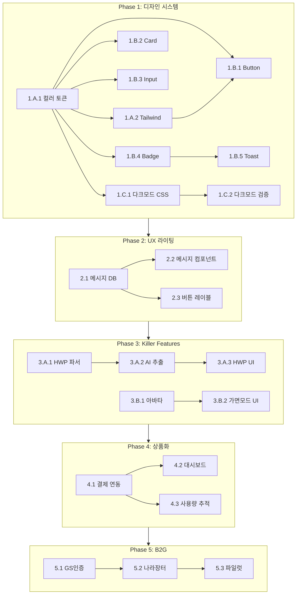

# 다잼(Dajam) 브랜딩 구현 워크플로우

> **Generated**: 2025-12-23
> **Source**: DAJAM_BRANDING_IMPROVEMENT_PLAN.md
> **Strategy**: Systematic (5-Phase, 24-Week)

---

## 워크플로우 개요

```
┌─────────────────────────────────────────────────────────────────────────────┐
│                        다잼 브랜딩 구현 워크플로우                              │
├─────────────────────────────────────────────────────────────────────────────┤
│                                                                             │
│  Phase 1          Phase 2          Phase 3          Phase 4       Phase 5  │
│  ┌──────┐        ┌──────┐        ┌──────────┐      ┌──────┐      ┌──────┐ │
│  │Design│   →    │  UX  │   →    │ Killer   │  →   │상품화│  →   │ B2G  │ │
│  │System│        │Writing│        │ Feature  │      │      │      │      │ │
│  └──────┘        └──────┘        └──────────┘      └──────┘      └──────┘ │
│   4 weeks         2 weeks          6 weeks          4 weeks       8 weeks  │
│                                                                             │
│  ────────────────────────────────────────────────────────────────────────── │
│  총 24주 (약 6개월)                                                          │
└─────────────────────────────────────────────────────────────────────────────┘
```

---

## Phase 1: 디자인 시스템 구축 (Week 1-4)

### Stream A: CSS/Tailwind 설정 (Week 1-2)

#### Task 1.A.1: 컬러 토큰 시스템 구축
**Priority**: 🔴 Critical | **Effort**: 4h | **Dependencies**: None

**파일 수정 목록**:
```
src/app/globals.css          # CSS 변수 확장
tailwind.config.ts            # Tailwind 색상 확장
```

**작업 내용**:
```css
/* globals.css에 추가할 내용 */
:root {
  /* Dajam Extended Palette */
  --dajam-green-50: #E8FAF0;
  --dajam-green-100: #C6F2D8;
  --dajam-green-200: #8BE4B3;
  --dajam-green-300: #50D78E;
  --dajam-green-400: #1AC96B;
  --dajam-green-500: #03C75A;  /* Primary */
  --dajam-green-600: #029547;
  --dajam-green-700: #017A3A;
  --dajam-green-800: #015F2D;
  --dajam-green-900: #004420;

  --dajam-yellow-50: #FFFDE7;
  --dajam-yellow-100: #FFF9C4;
  --dajam-yellow-200: #FFF176;
  --dajam-yellow-300: #FFEE58;
  --dajam-yellow-400: #FFE91B;
  --dajam-yellow-500: #FFD600;  /* Secondary */
  --dajam-yellow-600: #CCB100;
  --dajam-yellow-700: #998500;
  --dajam-yellow-800: #665900;
  --dajam-yellow-900: #332C00;
}
```

**검증 기준**:
- [ ] 모든 컬러가 WCAG AA 대비 기준 충족
- [ ] 다크 모드에서 가독성 확인
- [ ] Figma/Storybook과 색상 일치 확인

---

#### Task 1.A.2: Tailwind 확장 설정
**Priority**: 🔴 Critical | **Effort**: 3h | **Dependencies**: 1.A.1

**tailwind.config.ts 수정**:
```typescript
// 추가할 내용
const config: Config = {
  theme: {
    extend: {
      colors: {
        dajam: {
          green: {
            50: '#E8FAF0',
            100: '#C6F2D8',
            200: '#8BE4B3',
            300: '#50D78E',
            400: '#1AC96B',
            500: '#03C75A',
            600: '#029547',
            700: '#017A3A',
            800: '#015F2D',
            900: '#004420',
            DEFAULT: '#03C75A',
          },
          teal: {
            50: '#E6F2F1',
            100: '#CCE6E4',
            200: '#99CCC8',
            300: '#66B3AD',
            400: '#339991',
            500: '#007A6D',
            DEFAULT: '#005F55',
            600: '#004D46',
            700: '#003A34',
            800: '#002823',
            900: '#001511',
          },
          yellow: {
            50: '#FFFDE7',
            100: '#FFF9C4',
            200: '#FFF176',
            300: '#FFEE58',
            400: '#FFE91B',
            500: '#FFD600',
            600: '#CCB100',
            700: '#998500',
            800: '#665900',
            900: '#332C00',
            DEFAULT: '#FFD600',
          },
          red: '#DE354C',
          purple: '#7000FF',
          blue: '#0066FF',
        },
      },
      boxShadow: {
        'glow-green': '0 0 20px rgba(3, 199, 90, 0.25)',
        'glow-green-lg': '0 0 40px rgba(3, 199, 90, 0.35)',
        'glow-yellow': '0 0 20px rgba(255, 214, 0, 0.25)',
        'glow-red': '0 0 20px rgba(222, 53, 76, 0.25)',
        'glow-purple': '0 0 20px rgba(112, 0, 255, 0.25)',
        'neumorphism': '8px 8px 16px rgba(0,0,0,0.1), -8px -8px 16px rgba(255,255,255,0.8)',
        'neumorphism-dark': '8px 8px 16px rgba(0,0,0,0.3), -8px -8px 16px rgba(255,255,255,0.05)',
      },
      animation: {
        'correct-answer': 'correct-answer 0.5s ease-out',
        'wrong-answer': 'wrong-answer 0.4s ease-out',
        'rank-up': 'rank-up 0.6s ease-out',
        'rank-down': 'rank-down 0.6s ease-out',
        'pulse-glow': 'pulse-glow 2s ease-in-out infinite',
        'confetti': 'confetti 1s ease-out forwards',
      },
      keyframes: {
        'correct-answer': {
          '0%': { transform: 'scale(1)', backgroundColor: 'var(--dajam-green-500)' },
          '50%': { transform: 'scale(1.1)' },
          '100%': { transform: 'scale(1)' },
        },
        'wrong-answer': {
          '0%, 100%': { transform: 'translateX(0)' },
          '20%, 60%': { transform: 'translateX(-8px)' },
          '40%, 80%': { transform: 'translateX(8px)' },
        },
        'rank-up': {
          '0%': { transform: 'translateY(20px)', opacity: '0' },
          '100%': { transform: 'translateY(0)', opacity: '1' },
        },
        'rank-down': {
          '0%': { transform: 'translateY(-20px)', opacity: '0' },
          '100%': { transform: 'translateY(0)', opacity: '1' },
        },
        'pulse-glow': {
          '0%, 100%': { boxShadow: '0 0 20px rgba(3, 199, 90, 0.25)' },
          '50%': { boxShadow: '0 0 40px rgba(3, 199, 90, 0.5)' },
        },
      },
    },
  },
};
```

---

#### Task 1.A.3: 폰트 시스템 설정
**Priority**: 🟡 High | **Effort**: 2h | **Dependencies**: None

**작업 내용**:
1. Pretendard Variable 폰트 CDN 또는 Self-host
2. Jalnan 폰트 라이선스 확인 및 추가 (OFL 확인)
3. 폰트 로딩 최적화 (font-display: swap)

```css
/* globals.css 폰트 설정 */
@font-face {
  font-family: 'Pretendard';
  src: url('/fonts/PretendardVariable.woff2') format('woff2-variations');
  font-weight: 100 900;
  font-style: normal;
  font-display: swap;
}

@font-face {
  font-family: 'Jalnan';
  src: url('/fonts/Jalnan2.woff2') format('woff2');
  font-weight: 700;
  font-style: normal;
  font-display: swap;
}

:root {
  --font-sans: 'Pretendard', -apple-system, BlinkMacSystemFont, system-ui, sans-serif;
  --font-display: 'Jalnan', 'Noto Sans KR', sans-serif;
  --font-mono: 'JetBrains Mono', 'SF Mono', monospace;
}
```

**파일 생성**:
```
public/fonts/
├── PretendardVariable.woff2
└── Jalnan2.woff2
```

---

### Stream B: 핵심 컴포넌트 리팩토링 (Week 3-4)

#### Task 1.B.1: Button 컴포넌트 다잼 스타일 적용
**Priority**: 🔴 Critical | **Effort**: 4h | **Dependencies**: 1.A.1, 1.A.2

**파일**: `src/components/ui/button.tsx`

```typescript
import { cva, type VariantProps } from 'class-variance-authority';

const buttonVariants = cva(
  // Base styles
  'inline-flex items-center justify-center rounded-xl font-semibold transition-all duration-200 focus-visible:outline-none focus-visible:ring-4 disabled:pointer-events-none disabled:opacity-50',
  {
    variants: {
      variant: {
        // Dajam Primary - Green
        default: 'bg-dajam-green-500 text-white hover:bg-dajam-green-600 shadow-lg shadow-dajam-green-500/25 hover:shadow-glow-green active:scale-[0.98]',

        // Dajam Secondary - Yellow
        secondary: 'bg-dajam-yellow-500 text-gray-900 hover:bg-dajam-yellow-600 shadow-lg shadow-dajam-yellow-500/25 hover:shadow-glow-yellow active:scale-[0.98]',

        // Dajam Accent - Red (긴급, 경고)
        destructive: 'bg-dajam-red text-white hover:bg-dajam-red/90 shadow-lg shadow-dajam-red/25',

        // Dajam Ghost - Green outline
        outline: 'border-2 border-dajam-green-500 text-dajam-green-500 bg-transparent hover:bg-dajam-green-50 dark:hover:bg-dajam-green-500/10',

        // Dajam Ghost - No border
        ghost: 'text-dajam-green-500 hover:bg-dajam-green-50 dark:hover:bg-dajam-green-500/10',

        // Dajam Link
        link: 'text-dajam-blue underline-offset-4 hover:underline',
      },
      size: {
        sm: 'h-9 px-4 text-sm',
        default: 'h-11 px-6 text-base',
        lg: 'h-14 px-8 text-lg',
        xl: 'h-16 px-10 text-xl',
        icon: 'h-11 w-11',
      },
    },
    defaultVariants: {
      variant: 'default',
      size: 'default',
    },
  }
);
```

---

#### Task 1.B.2: Card 컴포넌트 뉴모피즘 적용
**Priority**: 🟡 High | **Effort**: 3h | **Dependencies**: 1.A.1

**파일**: `src/components/ui/card.tsx`

```typescript
const cardVariants = cva(
  'rounded-2xl transition-all duration-300',
  {
    variants: {
      variant: {
        // Standard Light
        default: 'bg-white border border-gray-100 shadow-sm hover:shadow-lg hover:border-dajam-green-200',

        // Featured - Gradient
        featured: 'bg-gradient-to-br from-dajam-green-500 to-dajam-teal-500 text-white shadow-xl shadow-dajam-green-500/25',

        // Neumorphism
        neumorphic: 'bg-gray-50 shadow-neumorphism dark:bg-gray-900 dark:shadow-neumorphism-dark',

        // Interactive (for quiz options)
        interactive: 'bg-white border-2 border-gray-200 cursor-pointer hover:border-dajam-green-400 hover:shadow-glow-green active:scale-[0.98]',

        // Selected state
        selected: 'bg-dajam-green-50 border-2 border-dajam-green-500 shadow-glow-green',

        // Correct answer
        correct: 'bg-dajam-green-100 border-2 border-dajam-green-500 animate-correct-answer',

        // Wrong answer
        wrong: 'bg-red-100 border-2 border-dajam-red animate-wrong-answer',
      },
    },
    defaultVariants: {
      variant: 'default',
    },
  }
);
```

---

#### Task 1.B.3: Input 컴포넌트 스타일 통일
**Priority**: 🟡 High | **Effort**: 2h | **Dependencies**: 1.A.1

**파일**: `src/components/ui/input.tsx`

```typescript
const inputVariants = cva(
  'w-full transition-all duration-200 outline-none font-medium placeholder:text-gray-400',
  {
    variants: {
      variant: {
        default: 'px-4 py-3 rounded-xl border-2 border-gray-200 bg-white focus:border-dajam-green-500 focus:ring-4 focus:ring-dajam-green-500/20',

        // PIN 코드 입력용
        pin: 'w-14 h-14 text-center text-2xl font-bold rounded-xl border-2 border-gray-200 focus:border-dajam-yellow-500 focus:ring-4 focus:ring-dajam-yellow-500/20',

        // 세션 코드 입력용
        sessionCode: 'text-center text-3xl font-bold tracking-[0.5em] uppercase px-6 py-4 rounded-2xl border-2 border-gray-200 focus:border-dajam-green-500',

        // 검색
        search: 'pl-12 pr-4 py-3 rounded-full border-2 border-gray-200 focus:border-dajam-green-500',
      },
      state: {
        default: '',
        error: 'border-dajam-red focus:border-dajam-red focus:ring-dajam-red/20',
        success: 'border-dajam-green-500 focus:border-dajam-green-500',
      },
    },
    defaultVariants: {
      variant: 'default',
      state: 'default',
    },
  }
);
```

---

#### Task 1.B.4: Badge 컴포넌트 신규 생성
**Priority**: 🟢 Medium | **Effort**: 2h | **Dependencies**: 1.A.1

**파일**: `src/components/ui/badge.tsx`

```typescript
const badgeVariants = cva(
  'inline-flex items-center gap-1.5 font-semibold transition-all',
  {
    variants: {
      variant: {
        default: 'bg-dajam-green-100 text-dajam-green-700 dark:bg-dajam-green-900 dark:text-dajam-green-300',
        secondary: 'bg-dajam-yellow-100 text-dajam-yellow-800',
        success: 'bg-dajam-green-500 text-white',
        warning: 'bg-dajam-yellow-500 text-gray-900',
        error: 'bg-dajam-red text-white',
        info: 'bg-dajam-blue text-white',
        outline: 'border-2 border-current bg-transparent',

        // 랭킹용
        rank1: 'bg-gradient-to-r from-yellow-400 to-amber-500 text-white shadow-lg',
        rank2: 'bg-gradient-to-r from-gray-300 to-gray-400 text-gray-800 shadow-md',
        rank3: 'bg-gradient-to-r from-amber-600 to-orange-700 text-white shadow-md',

        // 실시간 표시
        live: 'bg-dajam-red text-white animate-pulse',
      },
      size: {
        sm: 'px-2 py-0.5 text-xs rounded-md',
        default: 'px-3 py-1 text-sm rounded-lg',
        lg: 'px-4 py-1.5 text-base rounded-xl',
      },
    },
    defaultVariants: {
      variant: 'default',
      size: 'default',
    },
  }
);
```

---

#### Task 1.B.5: Toast/Feedback 컴포넌트 예능 스타일
**Priority**: 🟡 High | **Effort**: 3h | **Dependencies**: 1.A.1, 1.B.4

**파일**: `src/components/ui/feedback-toast.tsx`

```typescript
// 예능 스타일 피드백 토스트
interface FeedbackToastProps {
  type: 'correct' | 'wrong' | 'info' | 'rank-up' | 'rank-down';
  message?: string;
}

const feedbackMessages = {
  correct: [
    '와우! 혹시 천재?',
    '폼 미쳤다!',
    '정확해요!',
    '역시 센스쟁이!',
    '똑똑이 등장!',
  ],
  wrong: [
    '아깝다! 까비!',
    '동공지진...',
    '괜찮아요, 다음 문제 노려봐요!',
    '아슬아슬했어요!',
    '다음엔 분명히!',
  ],
  info: [
    '알아두면 좋아요!',
    '참고하세요!',
    '힌트예요!',
  ],
};

const FeedbackToast: React.FC<FeedbackToastProps> = ({ type, message }) => {
  const randomMessage = message ||
    feedbackMessages[type][Math.floor(Math.random() * feedbackMessages[type].length)];

  const variants = {
    correct: 'bg-dajam-green-500 text-white animate-correct-answer',
    wrong: 'bg-dajam-red text-white animate-wrong-answer',
    info: 'bg-dajam-blue text-white',
    'rank-up': 'bg-gradient-to-r from-dajam-green-500 to-dajam-yellow-500 text-white animate-rank-up',
    'rank-down': 'bg-gray-500 text-white animate-rank-down',
  };

  return (
    <div className={cn(
      'fixed top-1/2 left-1/2 -translate-x-1/2 -translate-y-1/2 z-50',
      'px-8 py-4 rounded-2xl font-display text-2xl shadow-2xl',
      variants[type]
    )}>
      {randomMessage}
    </div>
  );
};
```

---

### Stream C: 다크 모드 점검 (Week 4)

#### Task 1.C.1: 다크 모드 CSS 변수 완성
**Priority**: 🟡 High | **Effort**: 3h | **Dependencies**: 1.A.1

```css
.dark {
  /* Background */
  --background: 168 100% 11.8%;  /* Deep Teal */
  --foreground: 0 0% 98%;

  /* Cards */
  --card: 168 100% 15%;
  --card-foreground: 0 0% 98%;

  /* Primary (Dajam Green - 다크모드에서 더 밝게) */
  --primary: 149 97% 50%;
  --primary-foreground: 168 100% 10%;

  /* Borders */
  --border: 168 60% 25%;
  --input: 168 60% 25%;

  /* Ring (Focus) */
  --ring: 149 97% 50%;

  /* Semantic Colors (다크모드 최적화) */
  --dajam-green-500: #1AD96B;  /* 약간 더 밝게 */
  --dajam-yellow-500: #FFE41B;
  --dajam-red: #FF4D63;
}
```

#### Task 1.C.2: 컴포넌트별 다크 모드 검증
**Priority**: 🟢 Medium | **Effort**: 4h | **Dependencies**: 1.C.1

**체크리스트**:
- [ ] Button - 모든 variant 다크 모드 대비
- [ ] Card - 배경/보더 가독성
- [ ] Input - placeholder, focus ring
- [ ] Badge - 컬러 대비
- [ ] Toast - 가독성
- [ ] Navigation - 호버 상태
- [ ] 그래프/차트 - 색상 가독성

---

## Phase 2: UX 라이팅 적용 (Week 5-6)

### Task 2.1: 메시지 데이터베이스 구축
**Priority**: 🔴 Critical | **Effort**: 6h | **Dependencies**: Phase 1 완료

**파일 생성**: `src/lib/messages/index.ts`

```typescript
// src/lib/messages/feedback.ts
export const feedbackMessages = {
  quiz: {
    correct: [
      { text: '와우! 혹시 천재?', emoji: '🧠' },
      { text: '폼 미쳤다!', emoji: '🔥' },
      { text: '정확해요!', emoji: '✅' },
      { text: '역시 센스쟁이!', emoji: '✨' },
      { text: '똑똑이 등장!', emoji: '🎓' },
    ],
    wrong: [
      { text: '아깝다! 까비!', emoji: '😭' },
      { text: '동공지진...', emoji: '😵' },
      { text: '괜찮아요, 다음 문제 노려봐요!', emoji: '💪' },
      { text: '아슬아슬했어요!', emoji: '😬' },
      { text: '다음엔 분명히!', emoji: '🔜' },
    ],
    timeUp: [
      { text: '시간 초과!', emoji: '⏰' },
      { text: '조금만 더 빨랐으면...', emoji: '😅' },
    ],
  },

  ranking: {
    first: { text: '1등! 넘버원의 자리를 지켜요!', emoji: '🏆' },
    up: (n: number) => ({ text: `${n}등 상승! 치고 올라가는 중!`, emoji: '🚀' }),
    down: (n: number) => ({ text: `${n}등 하락... 다음 문제에서 역전!`, emoji: '📉' }),
    same: (n: number) => ({ text: `현재 ${n}등! 유지 중!`, emoji: '🎯' }),
  },

  engagement: {
    waiting: '지금 입장하면 선착순 혜택이!',
    lowParticipation: '조용하네요? 익명 모드로 솔직하게!',
    highEngagement: '와! 분위기 대박! 계속 가보자!',
    almostDone: '거의 다 왔어요! 조금만 더!',
  },
};

// src/lib/messages/ui.ts
export const uiMessages = {
  loading: {
    default: '잠시만요, 준비 중!',
    session: '세션을 불러오는 중...',
    results: '결과를 집계하고 있어요!',
  },

  empty: {
    participants: '아직 아무도 참여하지 않았어요',
    questions: '첫 번째 질문을 추가해보세요!',
    results: '아직 결과가 없어요',
  },

  success: {
    submit: '제출 완료!',
    join: '입장 완료! 환영해요!',
    create: '세션이 생성되었어요!',
    save: '저장되었어요!',
  },

  error: {
    network: '앗, 네트워크 연결을 확인해주세요!',
    sessionFull: '세션이 가득 찼어요 😢',
    sessionEnded: '이미 종료된 세션이에요',
    invalidCode: '코드가 맞지 않아요. 다시 확인해볼까요?',
  },

  buttons: {
    start: '지금 시작하기',
    join: '나도 참여할래',
    submit: '보내기',
    next: '다음으로',
    results: '결과 확인하기',
    share: '친구에게 알리기',
    retry: '다시 시도하기',
    back: '돌아가기',
    cancel: '취소',
    confirm: '확인',
  },
};
```

---

### Task 2.2: 메시지 컴포넌트 개발
**Priority**: 🟡 High | **Effort**: 4h | **Dependencies**: 2.1

**파일**: `src/components/messages/FeedbackMessage.tsx`

```typescript
'use client';

import { feedbackMessages, getRandomFeedback } from '@/lib/messages';
import { cn } from '@/lib/utils';
import { motion, AnimatePresence } from 'framer-motion';

interface FeedbackMessageProps {
  type: 'correct' | 'wrong' | 'timeUp';
  show: boolean;
  onComplete?: () => void;
}

export function FeedbackMessage({ type, show, onComplete }: FeedbackMessageProps) {
  const feedback = getRandomFeedback(type);

  const variants = {
    correct: {
      background: 'bg-dajam-green-500',
      animation: 'animate-correct-answer',
      scale: [1, 1.2, 1],
    },
    wrong: {
      background: 'bg-dajam-red',
      animation: 'animate-wrong-answer',
      x: [-8, 8, -8, 8, 0],
    },
    timeUp: {
      background: 'bg-dajam-yellow-500 text-gray-900',
      animation: '',
    },
  };

  return (
    <AnimatePresence>
      {show && (
        <motion.div
          initial={{ scale: 0.5, opacity: 0 }}
          animate={{ scale: 1, opacity: 1 }}
          exit={{ scale: 0.5, opacity: 0 }}
          onAnimationComplete={() => {
            setTimeout(onComplete, 1500);
          }}
          className={cn(
            'fixed inset-0 z-50 flex items-center justify-center bg-black/50',
          )}
        >
          <motion.div
            animate={variants[type]}
            className={cn(
              'px-12 py-6 rounded-3xl shadow-2xl',
              'font-display text-3xl text-white',
              variants[type].background,
            )}
          >
            <span className="mr-3 text-4xl">{feedback.emoji}</span>
            {feedback.text}
          </motion.div>
        </motion.div>
      )}
    </AnimatePresence>
  );
}
```

---

### Task 2.3: 버튼 레이블 일괄 교체
**Priority**: 🟢 Medium | **Effort**: 6h | **Dependencies**: 2.1

**작업 스크립트**:
```bash
# 검색 및 교체 대상 파일 목록 생성
grep -rn "시작" --include="*.tsx" src/
grep -rn "제출" --include="*.tsx" src/
grep -rn "다음" --include="*.tsx" src/
```

**교체 매핑**:
| 검색 | 교체 |
|------|------|
| `시작` | `지금 시작하기` |
| `제출` | `보내기` |
| `다음` | `다음으로` |
| `결과 보기` | `결과 확인하기` |
| `공유` | `친구에게 알리기` |
| `참여` | `나도 참여할래` |

---

## Phase 3: Killer Feature 개발 (Week 7-12)

### Stream A: HWP 매직 패스 (Week 7-10)

#### Task 3.A.1: HWP 파서 라이브러리 조사 및 선정
**Priority**: 🔴 Critical | **Effort**: 8h | **Dependencies**: None

**조사 대상**:
1. `hwpjs` - JavaScript HWP 파서
2. `hwp.js` - 오픈소스 HWP 리더
3. 한글과컴퓨터 API (유료)
4. Python hwp5 + Next.js API Route 연동

**선정 기준**:
- [ ] 테이블/이미지 파싱 지원
- [ ] 객관식 문제 형식 인식
- [ ] 라이선스 (상업적 이용)
- [ ] 유지보수 활발성
- [ ] 한글 인코딩 정확도

---

#### Task 3.A.2: AI 문제 추출 로직 설계
**Priority**: 🔴 Critical | **Effort**: 12h | **Dependencies**: 3.A.1

**아키텍처**:
```
[HWP 파일] → [HWP Parser] → [텍스트 추출] → [AI 분석] → [문제 객체]
                                              ↓
                                         OpenAI GPT-4
                                         or Claude API
```

**API 설계** (`src/app/api/hwp-parse/route.ts`):
```typescript
export async function POST(request: Request) {
  const formData = await request.formData();
  const file = formData.get('file') as File;

  // 1. HWP 파싱
  const textContent = await parseHWP(file);

  // 2. AI 문제 추출
  const questions = await extractQuestionsWithAI(textContent);

  // 3. 결과 반환
  return Response.json({
    success: true,
    questions,
    metadata: {
      totalQuestions: questions.length,
      types: getQuestionTypes(questions),
    }
  });
}
```

---

#### Task 3.A.3: HWP 업로드 UI 개발
**Priority**: 🟡 High | **Effort**: 8h | **Dependencies**: 3.A.1

**파일**: `src/components/hwp/HWPMagicPass.tsx`

```typescript
'use client';

import { useDropzone } from 'react-dropzone';
import { motion } from 'framer-motion';

export function HWPMagicPass() {
  const { getRootProps, getInputProps, isDragActive } = useDropzone({
    accept: { 'application/x-hwp': ['.hwp'] },
    maxFiles: 1,
    onDrop: async (files) => {
      // 파일 업로드 및 파싱
    },
  });

  return (
    <div className="p-8">
      <div
        {...getRootProps()}
        className={cn(
          'border-4 border-dashed rounded-3xl p-12 text-center cursor-pointer',
          'transition-all duration-300',
          isDragActive
            ? 'border-dajam-green-500 bg-dajam-green-50 scale-[1.02]'
            : 'border-gray-300 hover:border-dajam-green-400'
        )}
      >
        <input {...getInputProps()} />
        <div className="text-6xl mb-4">📄</div>
        <h3 className="text-2xl font-bold mb-2">
          HWP 매직 패스
        </h3>
        <p className="text-gray-500">
          HWP 파일을 드래그하거나 클릭해서 업로드하세요
        </p>
        <p className="text-sm text-dajam-green-600 mt-4">
          드래그 한 번으로 100문제를 3초 만에!
        </p>
      </div>
    </div>
  );
}
```

---

### Stream B: 가면 모드 (Week 10-12)

#### Task 3.B.1: 익명 사용자 아바타 시스템
**Priority**: 🟡 High | **Effort**: 6h | **Dependencies**: None

**파일**: `src/lib/avatar/mask-avatars.ts`

```typescript
// 복면가왕 스타일 가면 아바타 목록
export const maskAvatars = [
  { id: 'fox', name: '여우', emoji: '🦊', color: '#FF6B35' },
  { id: 'owl', name: '부엉이', emoji: '🦉', color: '#8B5CF6' },
  { id: 'lion', name: '사자', emoji: '🦁', color: '#F59E0B' },
  { id: 'rabbit', name: '토끼', emoji: '🐰', color: '#EC4899' },
  { id: 'bear', name: '곰', emoji: '🐻', color: '#78350F' },
  { id: 'panda', name: '판다', emoji: '🐼', color: '#1F2937' },
  { id: 'koala', name: '코알라', emoji: '🐨', color: '#6B7280' },
  { id: 'tiger', name: '호랑이', emoji: '🐯', color: '#EA580C' },
  { id: 'unicorn', name: '유니콘', emoji: '🦄', color: '#A855F7' },
  { id: 'dragon', name: '용', emoji: '🐲', color: '#16A34A' },
];

export function getRandomMaskAvatar() {
  return maskAvatars[Math.floor(Math.random() * maskAvatars.length)];
}
```

---

#### Task 3.B.2: 가면 모드 UI/UX
**Priority**: 🟡 High | **Effort**: 8h | **Dependencies**: 3.B.1

**파일**: `src/components/session/MaskModeToggle.tsx`

```typescript
'use client';

export function MaskModeToggle({ enabled, onToggle }) {
  return (
    <div className={cn(
      'p-4 rounded-2xl border-2 transition-all',
      enabled
        ? 'border-dajam-purple bg-purple-50 dark:bg-purple-950'
        : 'border-gray-200'
    )}>
      <div className="flex items-center justify-between">
        <div className="flex items-center gap-3">
          <span className="text-3xl">🎭</span>
          <div>
            <h4 className="font-bold">가면 모드</h4>
            <p className="text-sm text-gray-500">
              계급장 떼고, 솔직하게 한판 붙자!
            </p>
          </div>
        </div>
        <Switch
          checked={enabled}
          onCheckedChange={onToggle}
          className="data-[state=checked]:bg-dajam-purple"
        />
      </div>

      {enabled && (
        <motion.div
          initial={{ height: 0, opacity: 0 }}
          animate={{ height: 'auto', opacity: 1 }}
          className="mt-4 pt-4 border-t border-purple-200"
        >
          <p className="text-sm text-purple-600">
            ✅ 참여자 이름이 랜덤 가면으로 표시됩니다<br />
            ✅ 호스트도 누가 누군지 알 수 없어요<br />
            ✅ 솔직한 의견을 자유롭게 나눠보세요!
          </p>
        </motion.div>
      )}
    </div>
  );
}
```

---

## Phase 4: 상품화 (Week 13-16)

### Task 4.1: 결제 시스템 연동
**Priority**: 🔴 Critical | **Effort**: 16h | **Dependencies**: Phase 1-3 완료

**선택 옵션**:
1. **토스페이먼츠** (추천)
   - 한국 시장 최적화
   - 세금계산서 자동 발행
   - 카드/계좌이체/간편결제

2. **Stripe** (글로벌 확장 시)
   - 해외 결제 지원
   - Subscription 관리 용이

**파일 구조**:
```
src/app/api/payments/
├── create-session/route.ts    # 결제 세션 생성
├── webhook/route.ts           # 결제 완료 웹훅
├── cancel/route.ts            # 구독 취소
└── invoice/route.ts           # 세금계산서 발행
```

---

### Task 4.2: 요금제 관리 대시보드
**Priority**: 🟡 High | **Effort**: 12h | **Dependencies**: 4.1

**파일**: `src/app/(dashboard)/billing/page.tsx`

**구현 내용**:
- 현재 플랜 표시
- 결제 내역
- 플랜 업그레이드/다운그레이드
- 결제 수단 관리
- 세금계산서 다운로드

---

### Task 4.3: 사용량 추적 시스템
**Priority**: 🟡 High | **Effort**: 8h | **Dependencies**: 4.1

**DB 스키마 (Supabase)**:
```sql
CREATE TABLE usage_tracking (
  id UUID PRIMARY KEY DEFAULT gen_random_uuid(),
  user_id UUID REFERENCES auth.users(id),
  session_id UUID,
  participants_count INTEGER,
  questions_count INTEGER,
  created_at TIMESTAMPTZ DEFAULT now()
);

CREATE TABLE subscriptions (
  id UUID PRIMARY KEY DEFAULT gen_random_uuid(),
  user_id UUID REFERENCES auth.users(id) UNIQUE,
  plan_id TEXT NOT NULL, -- 'free', 'pro', 'enterprise'
  status TEXT NOT NULL, -- 'active', 'cancelled', 'past_due'
  current_period_start TIMESTAMPTZ,
  current_period_end TIMESTAMPTZ,
  created_at TIMESTAMPTZ DEFAULT now(),
  updated_at TIMESTAMPTZ DEFAULT now()
);
```

---

## Phase 5: B2G 진입 준비 (Week 17-24)

### Task 5.1: GS인증 준비
**Priority**: 🔴 Critical | **Effort**: 40h | **Dependencies**: Phase 1-4 완료

**필수 문서**:
- [ ] 소프트웨어 품질 보증 계획서
- [ ] 형상관리 계획서
- [ ] 테스트 계획서 및 결과서
- [ ] 사용자 매뉴얼
- [ ] 운영/유지보수 매뉴얼

**기술 요구사항**:
- [ ] 보안 취약점 점검 (시큐어 코딩)
- [ ] 성능 테스트 (동시접속 1000명)
- [ ] 접근성 테스트 (WCAG 2.1 AA)

---

### Task 5.2: 나라장터 등록
**Priority**: 🟡 High | **Effort**: 20h | **Dependencies**: 5.1

**등록 절차**:
1. 디지털서비스몰 판매자 등록
2. 상품 등록 (SaaS 카테고리)
3. 가격 정책 설정 (연간 라이선스)
4. 세금계산서 발행 시스템 연동

---

### Task 5.3: 파일럿 운영
**Priority**: 🟢 Medium | **Effort**: 80h (운영)

**타겟**:
- 교육청 1곳
- 지자체 1곳
- 대학교 1곳

**성공 지표**:
- 세션당 평균 참여율 80% 이상
- NPS 50 이상
- 재사용 의향 90% 이상

---

## 의존성 그래프



---

## 리소스 추정

| Phase | 기간 | 예상 공수 | 필요 역할 |
|-------|------|----------|-----------|
| Phase 1 | 4주 | 120h | Frontend Dev, Designer |
| Phase 2 | 2주 | 40h | Frontend Dev, UX Writer |
| Phase 3 | 6주 | 200h | Full-stack Dev, AI/ML |
| Phase 4 | 4주 | 100h | Full-stack Dev, PM |
| Phase 5 | 8주 | 160h | PM, QA, Legal |
| **Total** | **24주** | **620h** | - |

---

## 검증 체크포인트

### Phase 1 완료 기준
- [ ] 모든 컬러 토큰이 Tailwind에 적용됨
- [ ] 5개 핵심 컴포넌트 리팩토링 완료
- [ ] 다크 모드 전체 앱에서 정상 동작
- [ ] Lighthouse Accessibility 90+ 점

### Phase 2 완료 기준
- [ ] 메시지 DB 100개 이상 등록
- [ ] 모든 버튼 레이블 다잼 스타일로 교체
- [ ] FeedbackMessage 컴포넌트 통합

### Phase 3 완료 기준
- [ ] HWP 파일 업로드 → 퀴즈 생성 e2e 성공
- [ ] 가면 모드 익명성 100% 보장
- [ ] 파싱 정확도 90% 이상

### Phase 4 완료 기준
- [ ] 결제 테스트 100건 성공
- [ ] 세금계산서 자동 발행 정상
- [ ] 요금제별 기능 제한 정상

### Phase 5 완료 기준
- [ ] GS인증 획득
- [ ] 나라장터 등록 완료
- [ ] 파일럿 3곳 운영 완료

---

*워크플로우 생성일: 2025-12-23*
*Source: DAJAM_BRANDING_IMPROVEMENT_PLAN.md*
