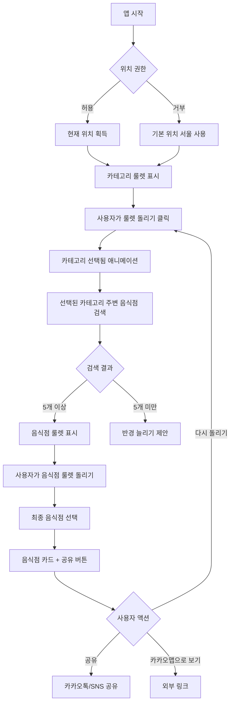

# 점심 메뉴 룰렛 (Lunch Menu Roulette)

> ⚠️ **통합 예정**: 이 앱은 `random-picker`로 통합될 예정입니다.
> - 통합 계획: `docs/APP_CONSOLIDATION_PLAN.md` 참조
> - 점심 모드로 랜덤 뽑기에 통합 (맛집 + 위치 기반 + 링크 추천)

## 1. 개요

### 1.1 핵심 가치
- **문제 해결**: "오늘 뭐 먹지?" 결정 피로(Decision Fatigue) 해결
- **위치 기반**: 사용자 주변 실제 음식점 추천으로 실용성 극대화
- **바이럴 효과**: 재미있는 룰렛 애니메이션 + 공유 기능으로 SNS 확산 유도

### 1.2 타겟 사용자
- 점심시간에 메뉴 결정이 어려운 직장인
- 회식 장소를 정해야 하는 팀장/간사
- 데이트 코스 식당을 찾는 커플

### 1.3 주요 차별점
- **즉시 사용 가능**: 회원가입 없이 위치 권한만으로 바로 사용
- **실제 음식점 연동**: 카카오맵 API로 현재 영업 중인 실제 매장 추천
- **다단계 룰렛**: 음식 카테고리 → 구체적 음식점 2단계 룰렛

---

## 2. 유사 서비스 분석

### 2.1 기존 서비스 현황

#### "뭐먹지 룰렛" (Android App)
- **특징**: 슬롯머신 방식으로 메뉴 랜덤 선택
- **한계**: 실제 음식점 정보 없음, 단순 메뉴 이름만 제공
- **출처**: [Google Play](https://play.google.com/store/apps/details?id=com.jmmechu_roulette2.app)

#### "맛집룰렛" (Android App)
- **특징**: 위치 기반 맛집 랜덤 추천
- **장점**: 현재 위치 반경 내 실제 음식점 추천
- **한계**: 모바일 앱만 지원, 웹 접근성 낮음
- **출처**: [Google Play](https://play.google.com/store/apps/details?id=com.fac.mealwheel)

### 2.2 우리 서비스의 차별화
| 비교 항목 | 기존 서비스 | 우리 서비스 |
|---------|-----------|-----------|
| 플랫폼 | 모바일 앱 | 웹 (PWA 가능) |
| 설치 | 필수 | 불필요 (즉시 사용) |
| 음식점 정보 | 제한적 | 카카오맵 연동 (리뷰, 영업시간, 전화번호) |
| 공유 | 스크린샷 | URL 공유 + 이미지 다운로드 |
| 필터링 | 없음 | 거리/가격대/카테고리 |

---

## 3. 오픈소스 라이브러리

### 3.1 룰렛 애니메이션
- **react-custom-roulette** (v1.4.1)
  - 가장 널리 사용되는 React 룰렛 라이브러리 (npm에서 6개 프로젝트가 의존)
  - TypeScript 호환, 이미지/텍스트 아이템 지원
  - 커스터마이징 가능한 회전 애니메이션
  - 출처: [npm](https://www.npmjs.com/package/react-custom-roulette)

- **대안**: React Roulette Pro
  - Next.js/Gatsby/Remix 프레임워크 지원
  - 수평/수직 룰렛 타입 지원
  - 플러그인 아키텍처

### 3.2 지도 및 위치 서비스
- **Kakao Maps JavaScript SDK**
  - 무료 웹 지도 API (일일 호출 한도: 300,000회)
  - Places API로 키워드/카테고리 검색
  - 모바일 웹 환경 완벽 지원
  - 출처: [Kakao Developers](https://apis.map.kakao.com/web/)

- **Geolocation API** (브라우저 내장)
  - 사용자 현재 위치 획득 (HTTPS 필수)

### 3.3 UI/애니메이션
- **Framer Motion** (optional)
  - 룰렛 결과 카드 애니메이션
  - 페이지 전환 효과

---

## 4. 기술 스택

### 4.1 프론트엔드
```json
{
  "framework": "Vite + React 19",
  "language": "TypeScript 5.x",
  "styling": "Tailwind CSS v4",
  "state": "Zustand (경량 상태관리)",
  "animation": "react-custom-roulette + Framer Motion"
}
```

### 4.2 외부 API
- **Kakao Maps JavaScript SDK** (v2)
  - Places API (키워드 검색)
  - Geocoder (주소 → 좌표 변환)
- **Geolocation API** (브라우저 내장)

### 4.3 배포 환경
- **호스팅**: Vercel / Netlify
- **도메인**: `lunch-roulette.seolcoding.com`
- **PWA**: 홈 화면 추가 지원 (manifest.json)

---

## 5. 핵심 기능 및 구현

### 5.1 카테고리 룰렛 (1단계)

#### 기능 설명
- 12가지 음식 카테고리 중 랜덤 선택
- 각 카테고리는 고유 색상과 이모지 아이콘

#### 카테고리 목록
```typescript
const FOOD_CATEGORIES = [
  { id: 'korean', name: '한식', emoji: '🍚', color: '#FF6B6B', kakaoCode: 'CE7' },
  { id: 'chinese', name: '중식', emoji: '🥟', color: '#FFD93D', kakaoCode: 'CE7' },
  { id: 'japanese', name: '일식', emoji: '🍣', color: '#FF8A80', kakaoCode: 'CE7' },
  { id: 'western', name: '양식', emoji: '🍝', color: '#A8E6CF', kakaoCode: 'CE7' },
  { id: 'chicken', name: '치킨', emoji: '🍗', color: '#FFAAA5', kakaoCode: 'FD6' },
  { id: 'pizza', name: '피자', emoji: '🍕', color: '#FF6B9D', kakaoCode: 'FD6' },
  { id: 'burger', name: '햄버거', emoji: '🍔', color: '#FFA07A', kakaoCode: 'FD6' },
  { id: 'cafe', name: '카페/디저트', emoji: '☕', color: '#D4A574', kakaoCode: 'CE7' },
  { id: 'snack', name: '분식', emoji: '🍜', color: '#FFB6C1', kakaoCode: 'FD6' },
  { id: 'meat', name: '고기/구이', emoji: '🥩', color: '#CD5C5C', kakaoCode: 'FD6' },
  { id: 'seafood', name: '해산물', emoji: '🦐', color: '#4FC3F7', kakaoCode: 'FD6' },
  { id: 'asian', name: '아시안', emoji: '🌮', color: '#BA68C8', kakaoCode: 'CE7' }
] as const;
```

#### 구현 코드
```typescript
// src/components/CategoryRoulette.tsx
import { Wheel } from 'react-custom-roulette';
import { useState } from 'react';
import type { WheelData } from 'react-custom-roulette/dist/components/Wheel/types';

interface CategoryRouletteProps {
  onCategorySelected: (category: FoodCategory) => void;
}

export const CategoryRoulette: React.FC<CategoryRouletteProps> = ({ onCategorySelected }) => {
  const [mustSpin, setMustSpin] = useState(false);
  const [prizeNumber, setPrizeNumber] = useState(0);

  const data: WheelData[] = FOOD_CATEGORIES.map(cat => ({
    option: `${cat.emoji} ${cat.name}`,
    style: { backgroundColor: cat.color, textColor: '#fff' }
  }));

  const handleSpinClick = () => {
    if (!mustSpin) {
      const newPrizeNumber = Math.floor(Math.random() * data.length);
      setPrizeNumber(newPrizeNumber);
      setMustSpin(true);
    }
  };

  const handleStopSpinning = () => {
    setMustSpin(false);
    onCategorySelected(FOOD_CATEGORIES[prizeNumber]);
  };

  return (
    <div className="flex flex-col items-center gap-8">
      <Wheel
        mustStartSpinning={mustSpin}
        prizeNumber={prizeNumber}
        data={data}
        onStopSpinning={handleStopSpinning}
        backgroundColors={['#3e3e3e', '#df3428']}
        textColors={['#ffffff']}
        outerBorderColor="#333"
        outerBorderWidth={8}
        innerBorderColor="#666"
        innerRadius={20}
        radiusLineColor="#666"
        radiusLineWidth={2}
        fontSize={16}
        perpendicularText={false}
        spinDuration={0.8}
      />
      <button
        onClick={handleSpinClick}
        disabled={mustSpin}
        className="px-8 py-4 bg-gradient-to-r from-orange-500 to-pink-500 text-white
                   text-xl font-bold rounded-full shadow-lg hover:shadow-xl
                   disabled:opacity-50 disabled:cursor-not-allowed
                   transform hover:scale-105 transition-all"
      >
        {mustSpin ? '룰렛 돌리는 중...' : '🎰 룰렛 돌리기'}
      </button>
    </div>
  );
};
```

---

### 5.2 위치 기반 음식점 검색 (카카오맵 API)

#### 기능 설명
- 사용자 현재 위치 기준 반경 내 음식점 검색
- 카테고리별 필터링
- 거리순/정확도순 정렬

#### 구현 코드

##### 5.2.1 Kakao Maps SDK 초기화
```typescript
// src/lib/kakao/init.ts
export const loadKakaoMapScript = (): Promise<void> => {
  return new Promise((resolve, reject) => {
    if (window.kakao && window.kakao.maps) {
      resolve();
      return;
    }

    const script = document.createElement('script');
    script.src = `//dapi.kakao.com/v2/maps/sdk.js?appkey=${import.meta.env.VITE_KAKAO_APP_KEY}&libraries=services&autoload=false`;
    script.async = true;

    script.onload = () => {
      window.kakao.maps.load(() => resolve());
    };
    script.onerror = () => reject(new Error('Kakao Maps SDK 로드 실패'));

    document.head.appendChild(script);
  });
};
```

##### 5.2.2 Places API 검색
```typescript
// src/lib/kakao/places.ts
interface SearchOptions {
  latitude: number;
  longitude: number;
  radius: number; // 미터 단위
  category?: string; // 카카오 카테고리 코드
  keyword?: string;
  sort?: 'accuracy' | 'distance';
}

export interface Place {
  id: string;
  place_name: string;
  category_name: string;
  address_name: string;
  road_address_name: string;
  phone: string;
  place_url: string;
  x: string; // 경도 (longitude)
  y: string; // 위도 (latitude)
  distance: string; // 미터 단위
}

export const searchPlaces = async (options: SearchOptions): Promise<Place[]> => {
  return new Promise((resolve, reject) => {
    const { latitude, longitude, radius, category, keyword, sort = 'distance' } = options;

    const places = new window.kakao.maps.services.Places();
    const location = new window.kakao.maps.LatLng(latitude, longitude);

    const callback = (result: Place[], status: any) => {
      if (status === window.kakao.maps.services.Status.OK) {
        resolve(result);
      } else if (status === window.kakao.maps.services.Status.ZERO_RESULT) {
        resolve([]);
      } else {
        reject(new Error('검색 중 오류 발생'));
      }
    };

    if (keyword) {
      // 키워드 검색 (카테고리 선택 후)
      places.keywordSearch(keyword, callback, {
        location,
        radius,
        sort: sort === 'distance' ? window.kakao.maps.services.SortBy.DISTANCE : window.kakao.maps.services.SortBy.ACCURACY,
        size: 15 // 최대 15개 결과
      });
    } else if (category) {
      // 카테고리 검색 (음식점: FD6, 카페: CE7)
      places.categorySearch(category, callback, {
        location,
        radius,
        sort: sort === 'distance' ? window.kakao.maps.services.SortBy.DISTANCE : window.kakao.maps.services.SortBy.ACCURACY,
        size: 15
      });
    } else {
      reject(new Error('키워드 또는 카테고리가 필요합니다'));
    }
  });
};
```

##### 5.2.3 위치 권한 획득
```typescript
// src/hooks/useGeolocation.ts
import { useState, useEffect } from 'react';

interface GeolocationState {
  latitude: number | null;
  longitude: number | null;
  error: string | null;
  loading: boolean;
}

export const useGeolocation = () => {
  const [state, setState] = useState<GeolocationState>({
    latitude: null,
    longitude: null,
    error: null,
    loading: true
  });

  useEffect(() => {
    if (!navigator.geolocation) {
      setState(prev => ({
        ...prev,
        error: '브라우저가 위치 서비스를 지원하지 않습니다',
        loading: false
      }));
      return;
    }

    navigator.geolocation.getCurrentPosition(
      (position) => {
        setState({
          latitude: position.coords.latitude,
          longitude: position.coords.longitude,
          error: null,
          loading: false
        });
      },
      (error) => {
        let errorMessage = '위치 정보를 가져올 수 없습니다';
        if (error.code === error.PERMISSION_DENIED) {
          errorMessage = '위치 권한이 거부되었습니다';
        }
        setState({
          latitude: null,
          longitude: null,
          error: errorMessage,
          loading: false
        });
      },
      {
        enableHighAccuracy: true,
        timeout: 10000,
        maximumAge: 0
      }
    );
  }, []);

  return state;
};
```

---

### 5.3 음식점 룰렛 (2단계)

#### 기능 설명
- 선택된 카테고리의 주변 음식점 중 랜덤 선택
- 최소 5개 이상의 음식점이 있을 때만 동작
- 결과 화면에 음식점 상세 정보 표시

#### 구현 코드
```typescript
// src/components/RestaurantRoulette.tsx
import { useEffect, useState } from 'react';
import { Wheel } from 'react-custom-roulette';
import { searchPlaces, type Place } from '@/lib/kakao/places';

interface RestaurantRouletteProps {
  category: FoodCategory;
  latitude: number;
  longitude: number;
  radius: number; // 미터
}

export const RestaurantRoulette: React.FC<RestaurantRouletteProps> = ({
  category,
  latitude,
  longitude,
  radius
}) => {
  const [places, setPlaces] = useState<Place[]>([]);
  const [loading, setLoading] = useState(true);
  const [mustSpin, setMustSpin] = useState(false);
  const [prizeNumber, setPrizeNumber] = useState(0);
  const [selectedPlace, setSelectedPlace] = useState<Place | null>(null);

  useEffect(() => {
    const fetchPlaces = async () => {
      try {
        setLoading(true);
        const results = await searchPlaces({
          latitude,
          longitude,
          radius,
          keyword: category.name, // 예: '한식', '중식'
          sort: 'distance'
        });
        setPlaces(results);
      } catch (error) {
        console.error('음식점 검색 실패:', error);
      } finally {
        setLoading(false);
      }
    };

    fetchPlaces();
  }, [category, latitude, longitude, radius]);

  if (loading) {
    return <div className="text-center py-12">음식점 검색 중...</div>;
  }

  if (places.length === 0) {
    return (
      <div className="text-center py-12">
        <p className="text-xl mb-4">주변에 {category.name} 음식점이 없습니다 😢</p>
        <p className="text-gray-600">검색 반경을 늘려보세요</p>
      </div>
    );
  }

  const data = places.slice(0, 10).map(place => ({
    option: place.place_name,
    style: { backgroundColor: category.color, textColor: '#fff' }
  }));

  const handleSpinClick = () => {
    if (!mustSpin && places.length > 0) {
      const newPrizeNumber = Math.floor(Math.random() * Math.min(places.length, 10));
      setPrizeNumber(newPrizeNumber);
      setMustSpin(true);
    }
  };

  const handleStopSpinning = () => {
    setMustSpin(false);
    setSelectedPlace(places[prizeNumber]);
  };

  return (
    <div className="space-y-8">
      <div className="text-center">
        <h2 className="text-2xl font-bold mb-2">
          {category.emoji} {category.name} 음식점 룰렛
        </h2>
        <p className="text-gray-600">
          {places.length}개의 음식점을 찾았습니다
        </p>
      </div>

      <div className="flex flex-col items-center gap-8">
        <Wheel
          mustStartSpinning={mustSpin}
          prizeNumber={prizeNumber}
          data={data}
          onStopSpinning={handleStopSpinning}
          backgroundColors={[category.color, '#3e3e3e']}
          textColors={['#ffffff']}
          outerBorderWidth={8}
          innerRadius={20}
          spinDuration={1.2}
        />

        <button
          onClick={handleSpinClick}
          disabled={mustSpin}
          className="px-8 py-4 bg-gradient-to-r from-blue-500 to-purple-500
                     text-white text-xl font-bold rounded-full shadow-lg
                     disabled:opacity-50 transform hover:scale-105 transition-all"
        >
          {mustSpin ? '음식점 고르는 중...' : '🎲 음식점 뽑기'}
        </button>
      </div>

      {selectedPlace && (
        <RestaurantCard place={selectedPlace} />
      )}
    </div>
  );
};
```

---

### 5.4 필터링 옵션

#### 구현 코드
```typescript
// src/components/FilterPanel.tsx
interface FilterPanelProps {
  radius: number;
  onRadiusChange: (radius: number) => void;
}

export const FilterPanel: React.FC<FilterPanelProps> = ({ radius, onRadiusChange }) => {
  const radiusOptions = [
    { value: 500, label: '500m' },
    { value: 1000, label: '1km' },
    { value: 2000, label: '2km' },
    { value: 5000, label: '5km' }
  ];

  return (
    <div className="bg-white p-6 rounded-xl shadow-md">
      <h3 className="font-bold text-lg mb-4">필터 설정</h3>

      <div className="space-y-4">
        <div>
          <label className="block text-sm font-medium text-gray-700 mb-2">
            검색 반경
          </label>
          <div className="flex gap-2">
            {radiusOptions.map(option => (
              <button
                key={option.value}
                onClick={() => onRadiusChange(option.value)}
                className={`flex-1 py-2 px-4 rounded-lg font-medium transition-all ${
                  radius === option.value
                    ? 'bg-blue-500 text-white shadow-md'
                    : 'bg-gray-100 text-gray-700 hover:bg-gray-200'
                }`}
              >
                {option.label}
              </button>
            ))}
          </div>
        </div>
      </div>
    </div>
  );
};
```

---

### 5.5 결과 공유 기능

#### 기능 설명
- 선택된 음식점 정보를 이미지로 변환
- 카카오톡, 트위터, 페이스북 공유
- URL 복사 (쿼리 파라미터로 결과 전달)

#### 구현 코드
```typescript
// src/components/ShareButtons.tsx
import { useCallback } from 'react';

interface ShareButtonsProps {
  placeName: string;
  placeUrl: string;
}

export const ShareButtons: React.FC<ShareButtonsProps> = ({ placeName, placeUrl }) => {
  const shareUrl = `${window.location.origin}?restaurant=${encodeURIComponent(placeName)}`;
  const shareText = `오늘 점심은 "${placeName}"! 🎰 점심 메뉴 룰렛으로 정했어요`;

  const handleKakaoShare = useCallback(() => {
    if (window.Kakao) {
      window.Kakao.Share.sendDefault({
        objectType: 'feed',
        content: {
          title: '점심 메뉴 룰렛 결과',
          description: shareText,
          imageUrl: 'https://lunch-roulette.seolcoding.com/og-image.png',
          link: {
            mobileWebUrl: shareUrl,
            webUrl: shareUrl
          }
        },
        buttons: [
          {
            title: '나도 돌려보기',
            link: {
              mobileWebUrl: shareUrl,
              webUrl: shareUrl
            }
          }
        ]
      });
    }
  }, [shareText, shareUrl]);

  const handleTwitterShare = () => {
    const url = `https://twitter.com/intent/tweet?text=${encodeURIComponent(shareText)}&url=${encodeURIComponent(shareUrl)}`;
    window.open(url, '_blank', 'width=550,height=420');
  };

  const handleCopyUrl = async () => {
    try {
      await navigator.clipboard.writeText(shareUrl);
      alert('링크가 복사되었습니다!');
    } catch (error) {
      console.error('복사 실패:', error);
    }
  };

  return (
    <div className="flex gap-3 justify-center">
      <button
        onClick={handleKakaoShare}
        className="flex items-center gap-2 px-6 py-3 bg-[#FEE500] text-black
                   rounded-lg font-medium hover:bg-[#FFEB00] transition-colors"
      >
        💬 카카오톡 공유
      </button>
      <button
        onClick={handleTwitterShare}
        className="flex items-center gap-2 px-6 py-3 bg-[#1DA1F2] text-white
                   rounded-lg font-medium hover:bg-[#1a8cd8] transition-colors"
      >
        🐦 트위터 공유
      </button>
      <button
        onClick={handleCopyUrl}
        className="flex items-center gap-2 px-6 py-3 bg-gray-700 text-white
                   rounded-lg font-medium hover:bg-gray-800 transition-colors"
      >
        🔗 링크 복사
      </button>
    </div>
  );
};
```

---

## 6. 카카오맵 API 연동 완전 가이드

### 6.1 API 키 발급
1. [Kakao Developers](https://developers.kakao.com/) 로그인
2. 내 애플리케이션 → 애플리케이션 추가하기
3. Web 플랫폼 등록 (사이트 도메인: `http://localhost:5173`, `https://lunch-roulette.seolcoding.com`)
4. JavaScript 키 복사

### 6.2 환경 변수 설정
```bash
# .env.local
VITE_KAKAO_APP_KEY=your_javascript_key_here
```

### 6.3 TypeScript 타입 정의
```typescript
// src/types/kakao.d.ts
declare global {
  interface Window {
    kakao: {
      maps: {
        load: (callback: () => void) => void;
        LatLng: new (lat: number, lng: number) => any;
        services: {
          Places: new (map?: any) => {
            keywordSearch: (
              keyword: string,
              callback: (result: any[], status: any) => void,
              options?: {
                location?: any;
                radius?: number;
                bounds?: any;
                page?: number;
                size?: number;
                sort?: any;
              }
            ) => void;
            categorySearch: (
              code: string,
              callback: (result: any[], status: any) => void,
              options?: {
                location?: any;
                radius?: number;
                bounds?: any;
                page?: number;
                size?: number;
                sort?: any;
              }
            ) => void;
          };
          Status: {
            OK: string;
            ZERO_RESULT: string;
            ERROR: string;
          };
          SortBy: {
            ACCURACY: string;
            DISTANCE: string;
          };
        };
      };
      Share: {
        sendDefault: (settings: any) => void;
      };
    };
  }
}

export {};
```

### 6.4 카테고리 코드 참조
| 카테고리 | 코드 | 설명 |
|---------|------|------|
| 음식점 | FD6 | 모든 음식점 |
| 카페 | CE7 | 카페/디저트 |
| 한식 | FD6 | 키워드 '한식'으로 검색 |
| 중식 | FD6 | 키워드 '중식'으로 검색 |
| 일식 | FD6 | 키워드 '일식'으로 검색 |

---

## 7. 룰렛 애니메이션 심화

### 7.1 커스텀 룰렛 디자인
```typescript
// src/components/CustomWheel.tsx
import { Wheel } from 'react-custom-roulette';

interface CustomWheelProps {
  data: Array<{ option: string; style?: { backgroundColor: string; textColor: string } }>;
  prizeNumber: number;
  mustSpin: boolean;
  onStopSpinning: () => void;
}

export const CustomWheel: React.FC<CustomWheelProps> = ({
  data,
  prizeNumber,
  mustSpin,
  onStopSpinning
}) => {
  return (
    <div className="relative">
      {/* 룰렛 포인터 */}
      <div className="absolute top-0 left-1/2 -translate-x-1/2 -translate-y-2 z-10">
        <div className="w-0 h-0 border-l-[20px] border-l-transparent
                        border-r-[20px] border-r-transparent
                        border-t-[40px] border-t-red-500
                        drop-shadow-lg" />
      </div>

      <Wheel
        mustStartSpinning={mustSpin}
        prizeNumber={prizeNumber}
        data={data}
        onStopSpinning={onStopSpinning}
        backgroundColors={['#3e3e3e', '#df3428']}
        textColors={['#ffffff']}
        outerBorderColor="#FFD700"
        outerBorderWidth={10}
        innerBorderColor="#FFA500"
        innerBorderWidth={5}
        innerRadius={30}
        radiusLineColor="#666"
        radiusLineWidth={3}
        fontSize={18}
        fontWeight={700}
        fontFamily="Pretendard Variable, sans-serif"
        perpendicularText={false}
        textDistance={65}
        spinDuration={0.8}
      />

      {/* 중앙 장식 */}
      <div className="absolute top-1/2 left-1/2 -translate-x-1/2 -translate-y-1/2
                      w-16 h-16 bg-gradient-to-br from-yellow-400 to-orange-500
                      rounded-full shadow-xl border-4 border-white
                      flex items-center justify-center text-2xl">
        🎰
      </div>
    </div>
  );
};
```

### 7.2 사운드 효과 (선택)
```typescript
// src/hooks/useRouletteSound.ts
import { useEffect, useRef } from 'react';

export const useRouletteSound = (mustSpin: boolean) => {
  const audioRef = useRef<HTMLAudioElement | null>(null);

  useEffect(() => {
    // Public 폴더에 roulette-spin.mp3 파일 필요
    audioRef.current = new Audio('/sounds/roulette-spin.mp3');
    audioRef.current.volume = 0.3;
  }, []);

  useEffect(() => {
    if (mustSpin && audioRef.current) {
      audioRef.current.currentTime = 0;
      audioRef.current.play();
    }
  }, [mustSpin]);
};
```

---

## 8. 컴포넌트 구조

```
src/
├── components/
│   ├── CategoryRoulette.tsx       # 1단계: 음식 카테고리 룰렛
│   ├── RestaurantRoulette.tsx     # 2단계: 음식점 룰렛
│   ├── CustomWheel.tsx            # 커스텀 룰렛 디자인
│   ├── RestaurantCard.tsx         # 선택된 음식점 정보 카드
│   ├── FilterPanel.tsx            # 검색 반경 필터
│   ├── ShareButtons.tsx           # 공유 버튼
│   └── LocationPermission.tsx     # 위치 권한 요청 UI
├── hooks/
│   ├── useGeolocation.ts          # Geolocation API 훅
│   ├── useKakaoPlaces.ts          # Kakao Places API 훅
│   └── useRouletteSound.ts        # 사운드 효과 훅
├── lib/
│   └── kakao/
│       ├── init.ts                # SDK 초기화
│       └── places.ts              # Places API 래퍼
├── types/
│   ├── kakao.d.ts                 # Kakao API 타입
│   └── food.ts                    # 음식 카테고리 타입
├── constants/
│   └── foodCategories.ts          # 카테고리 데이터
├── App.tsx                        # 메인 앱 컴포넌트
└── main.tsx                       # 엔트리 포인트
```

---

## 9. 사용자 플로우



---

## 10. 배포 체크리스트

### 10.1 환경 변수
- [ ] `VITE_KAKAO_APP_KEY` 설정 (Vercel/Netlify 환경 변수)
- [ ] 프로덕션 도메인을 Kakao Developers에 등록

### 10.2 성능 최적화
- [ ] 이미지 최적화 (WebP 포맷)
- [ ] 코드 스플리팅 (React.lazy)
- [ ] Lighthouse 점수 90점 이상

### 10.3 SEO 및 메타태그
```html
<!-- index.html -->
<meta name="description" content="오늘 뭐 먹지? 점심 메뉴 고민 끝! 룰렛으로 주변 맛집 추천받으세요">
<meta property="og:title" content="점심 메뉴 룰렛">
<meta property="og:description" content="위치 기반 맛집 추천 룰렛">
<meta property="og:image" content="https://lunch-roulette.seolcoding.com/og-image.png">
<meta name="twitter:card" content="summary_large_image">
```

### 10.4 PWA 설정
```json
// public/manifest.json
{
  "name": "점심 메뉴 룰렛",
  "short_name": "메뉴룰렛",
  "description": "위치 기반 맛집 추천 룰렛",
  "start_url": "/",
  "display": "standalone",
  "background_color": "#ffffff",
  "theme_color": "#FF6B6B",
  "icons": [
    {
      "src": "/icons/icon-192.png",
      "sizes": "192x192",
      "type": "image/png"
    },
    {
      "src": "/icons/icon-512.png",
      "sizes": "512x512",
      "type": "image/png"
    }
  ]
}
```

---

## 11. 향후 확장 아이디어

### 11.1 개인화 기능
- 선호 음식/싫어하는 음식 필터링
- 최근 방문 음식점 제외
- 즐겨찾기 기능

### 11.2 소셜 기능
- 친구들과 함께 룰렛 돌리기 (실시간 동기화)
- 회사/팀별 점심 투표
- 오늘의 인기 음식점 랭킹

### 11.3 데이터 분석
- 가장 많이 선택된 카테고리 통계
- 지역별 인기 음식점
- 시간대별 추천 (점심/저녁)

---

## 12. 레퍼런스

### 공식 문서
- [Kakao Maps Web API 문서](https://apis.map.kakao.com/web/)
- [react-custom-roulette npm](https://www.npmjs.com/package/react-custom-roulette)
- [Geolocation API - MDN](https://developer.mozilla.org/ko/docs/Web/API/Geolocation_API)

### 유사 서비스
- [뭐먹지 룰렛 - Google Play](https://play.google.com/store/apps/details?id=com.jmmechu_roulette2.app)
- [맛집룰렛 - Google Play](https://play.google.com/store/apps/details?id=com.fac.mealwheel)

---

## 부록: 빠른 시작 가이드

```bash
# 1. 프로젝트 생성
npm create vite@latest lunch-roulette -- --template react-ts
cd lunch-roulette

# 2. 의존성 설치
npm install react-custom-roulette zustand
npm install -D tailwindcss postcss autoprefixer
npx tailwindcss init -p

# 3. 환경 변수 설정
echo "VITE_KAKAO_APP_KEY=your_key" > .env.local

# 4. 개발 서버 실행
npm run dev
```

이제 `http://localhost:5173`에서 개발을 시작하세요!

---

## 13. MCP 개발 도구

### 13.1 UI 컴포넌트 개발
- **Shadcn UI**: 검증된 컴포넌트 라이브러리
- `pnpm dlx shadcn@latest add [component]`로 추가
- `@mini-apps/ui` 패키지에서 공유

### 13.2 브라우저 테스트
- **Chrome DevTools MCP**: 실시간 UI 확인 및 디버깅
- 스냅샷/스크린샷으로 렌더링 확인
- 콘솔/네트워크 요청 분석
- 반응형 테스트 (모바일 뷰포트)

> 자세한 사용법은 `agents/mini-apps/CLAUDE.md` 참조
