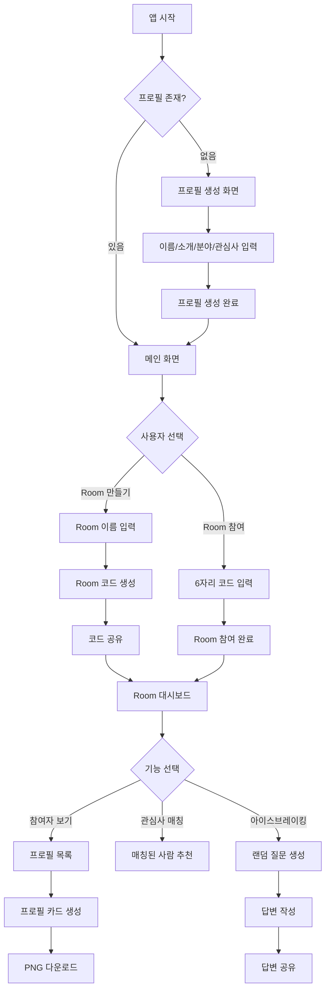

# 수강생 네트워킹 플랫폼 (Student Networking Platform)

## 1. 개요

### 1.1 핵심 가치
- **문제 해결**: 교육 과정 수강생들의 네트워킹 어려움 해결
- **학력 편견 제거**: 학력이 아닌 전공/관심사 중심의 프로필
- **즉시 사용**: 회원가입 없이 localStorage 기반으로 즉시 사용 가능
- **프라이버시 우선**: 서버 없이 브라우저 내에서만 데이터 저장

### 1.2 타겟 사용자
- 부트캠프/코딩 교육 과정 수강생
- 온라인 강의 수강생 (동기들과 연결 원하는 사람)
- 스터디 그룹 멤버
- 네트워킹 이벤트 참여자

### 1.3 주요 차별점
- **학력 제외**: 대학/학위 정보 수집하지 않음 - 전공/분야와 관심사만 강조
- **완전 프라이버시**: 서버 없이 localStorage만 사용, 개인정보 유출 위험 제로
- **시각적 프로필 카드**: Canvas로 생성한 공유 가능한 명함 이미지
- **아이스브레이킹**: 랜덤 질문으로 대화 시작 돕기

---

## 2. 유사 서비스 분석

### 2.1 기존 서비스 현황

#### Blinq Digital Business Card
- **특징**: QR 코드 기반 디지털 명함, 프로필 공유
- **장점**: 깔끔한 UI, 다양한 SNS 링크 연동
- **한계**: 개인 명함 중심, 그룹/교실 기능 없음
- **출처**: [Blinq App Store](https://apps.apple.com/us/app/blinq-digital-business-card/id1324102258)

#### Instagram Profile Cards
- **특징**: 프로필을 카드 형태로 공유, QR 코드 포함
- **장점**: 친숙한 플랫폼, 쉬운 공유
- **한계**: 일반 소셜미디어 용도, 교육/네트워킹 특화 기능 없음
- **출처**: [Instagram Profile Cards](https://www.instagram.com/p/DBKig5rSFEW/)

#### LinkedIn Student Network
- **특징**: 학생 네트워킹, 프로필 공유
- **장점**: 전문적인 네트워크 구축
- **한계**: 학력 중심, 무거운 플랫폼, 즉시 사용 불가

### 2.2 우리 서비스의 차별화
| 비교 항목 | 기존 서비스 | 우리 서비스 |
|---------|-----------|-----------|
| 회원가입 | 필수 | 불필요 (즉시 사용) |
| 데이터 저장 | 서버 (프라이버시 우려) | localStorage (완전 비공개) |
| 학력 정보 | 강조됨 | 수집 안 함 |
| 교실 기능 | 없음 | 강의별 Room 코드 |
| 관심사 매칭 | 제한적 | 태그 기반 자동 매칭 |
| 아이스브레이킹 | 없음 | 랜덤 질문 제공 |

---

## 3. 오픈소스 라이브러리

### 3.1 UI 컴포넌트
- **shadcn/ui** (권장)
  - Tailwind CSS 기반 컴포넌트
  - 복사해서 커스터마이징 가능
  - Card, Button, Input, Dialog 등 제공
  - 출처: [shadcn/ui](https://ui.shadcn.com/)

- **대안**: Chakra UI, MUI
  - 더 많은 기능, 하지만 번들 크기 증가

### 3.2 Canvas 이미지 생성
- **html2canvas** (v1.4.1)
  - HTML 요소를 Canvas로 변환
  - PNG/JPEG 다운로드 가능
  - TypeScript 지원
  - 출처: [npm](https://www.npmjs.com/package/html2canvas)

- **대안**: dom-to-image-more
  - 더 정확한 렌더링
  - SVG 지원

### 3.3 QR 코드 생성
- **qrcode.react** (v4.1.0)
  - React 컴포넌트로 QR 코드 생성
  - SVG/Canvas 렌더링 옵션
  - 커스터마이징 가능 (색상, 크기, 로고)
  - 출처: [npm](https://www.npmjs.com/package/qrcode.react)

### 3.4 상태 관리
- **Zustand** (v4.5.0)
  - 경량 상태 관리 라이브러리 (1KB)
  - localStorage persistence 플러그인
  - TypeScript 완벽 지원

---

## 4. 기술 스택

### 4.1 프론트엔드
```json
{
  "framework": "Vite + React 19",
  "language": "TypeScript 5.x",
  "styling": "Tailwind CSS v4",
  "ui": "shadcn/ui",
  "state": "Zustand + persist middleware",
  "storage": "localStorage / IndexedDB (대용량 이미지)"
}
```

### 4.2 라이브러리
- **html2canvas**: 프로필 카드 이미지 생성
- **qrcode.react**: QR 코드 생성
- **nanoid**: 고유 ID 생성 (Room 코드, Profile ID)
- **clsx**: 조건부 className 관리
- **date-fns**: 날짜 포맷팅

### 4.3 배포 환경
- **호스팅**: Vercel / Netlify
- **도메인**: `student-network.seolcoding.com`
- **PWA**: 오프라인 지원, 홈 화면 추가

---

## 5. 핵심 기능 및 구현

### 5.1 프로필 생성

#### 기능 설명
- 이름, 한줄 소개 (30자 제한)
- 전공/분야 (드롭다운 + 직접 입력)
- 관심사 태그 (최대 5개, 미리 정의된 태그 + 커스텀)
- 연락처 (선택): 이메일, GitHub, LinkedIn, 개인 URL
- 프로필 이미지 업로드 (선택)

#### 전공/분야 목록
```typescript
const FIELD_OPTIONS = [
  '프론트엔드 개발',
  '백엔드 개발',
  '풀스택 개발',
  'AI/ML',
  '데이터 사이언스',
  '모바일 앱 개발',
  'DevOps/인프라',
  '게임 개발',
  'UI/UX 디자인',
  '프로덕트 매니징',
  '디지털 마케팅',
  '창업/스타트업',
  '기타'
] as const;
```

#### 관심사 태그 프리셋
```typescript
const INTEREST_TAGS = [
  // 기술 스택
  'React', 'Vue', 'Angular', 'Next.js', 'TypeScript',
  'Node.js', 'Python', 'Java', 'Go', 'Rust',
  'AWS', 'Docker', 'Kubernetes',

  // 주제
  '웹 개발', '모바일 앱', '머신러닝', '블록체인',
  '클라우드', '보안', '게임 개발',

  // 관심사
  '오픈소스', '사이드 프로젝트', '블로그 작성',
  '컨퍼런스', '스터디', '해커톤',
  '독서', '운동', '여행', '음악', '사진'
] as const;
```

#### 구현 코드
```typescript
// src/components/ProfileForm.tsx
import { useState } from 'react';
import { useProfileStore } from '@/store/profileStore';
import { nanoid } from 'nanoid';
import type { Profile } from '@/types';

export const ProfileForm: React.FC = () => {
  const { createProfile } = useProfileStore();
  const [formData, setFormData] = useState<Partial<Profile>>({
    name: '',
    tagline: '',
    field: '',
    interests: [],
    contacts: {
      email: '',
      github: '',
      linkedin: '',
      website: ''
    },
    avatarUrl: ''
  });

  const [selectedInterests, setSelectedInterests] = useState<string[]>([]);

  const handleAddInterest = (interest: string) => {
    if (selectedInterests.length < 5 && !selectedInterests.includes(interest)) {
      setSelectedInterests([...selectedInterests, interest]);
    }
  };

  const handleRemoveInterest = (interest: string) => {
    setSelectedInterests(selectedInterests.filter(i => i !== interest));
  };

  const handleImageUpload = (e: React.ChangeEvent<HTMLInputElement>) => {
    const file = e.target.files?.[0];
    if (file) {
      const reader = new FileReader();
      reader.onloadend = () => {
        setFormData({ ...formData, avatarUrl: reader.result as string });
      };
      reader.readAsDataURL(file);
    }
  };

  const handleSubmit = (e: React.FormEvent) => {
    e.preventDefault();

    const profile: Profile = {
      id: nanoid(),
      name: formData.name!,
      tagline: formData.tagline!,
      field: formData.field!,
      interests: selectedInterests,
      contacts: formData.contacts!,
      avatarUrl: formData.avatarUrl,
      createdAt: new Date().toISOString()
    };

    createProfile(profile);
  };

  return (
    <form onSubmit={handleSubmit} className="space-y-6 max-w-2xl mx-auto p-6">
      {/* 프로필 이미지 */}
      <div className="flex flex-col items-center gap-4">
        {formData.avatarUrl ? (
          
        ) : (
          <div className="w-32 h-32 rounded-full bg-gray-200 flex items-center justify-center">
            <span className="text-4xl">👤</span>
          </div>
        )}
        <label className="px-4 py-2 bg-blue-500 text-white rounded-lg cursor-pointer hover:bg-blue-600">
          프로필 사진 업로드
          <input
            type="file"
            accept="image/*"
            onChange={handleImageUpload}
            className="hidden"
          />
        </label>
      </div>

      {/* 이름 */}
      <div>
        <label className="block text-sm font-medium mb-2">이름 *</label>
        <input
          type="text"
          required
          maxLength={20}
          value={formData.name}
          onChange={(e) => setFormData({ ...formData, name: e.target.value })}
          className="w-full px-4 py-2 border rounded-lg focus:ring-2 focus:ring-blue-500"
          placeholder="홍길동"
        />
      </div>

      {/* 한줄 소개 */}
      <div>
        <label className="block text-sm font-medium mb-2">한줄 소개 *</label>
        <input
          type="text"
          required
          maxLength={30}
          value={formData.tagline}
          onChange={(e) => setFormData({ ...formData, tagline: e.target.value })}
          className="w-full px-4 py-2 border rounded-lg focus:ring-2 focus:ring-blue-500"
          placeholder="웹 개발에 열정이 있는 주니어 개발자"
        />
        <p className="text-sm text-gray-500 mt-1">
          {formData.tagline?.length || 0}/30
        </p>
      </div>

      {/* 전공/분야 */}
      <div>
        <label className="block text-sm font-medium mb-2">전공/분야 *</label>
        <select
          required
          value={formData.field}
          onChange={(e) => setFormData({ ...formData, field: e.target.value })}
          className="w-full px-4 py-2 border rounded-lg focus:ring-2 focus:ring-blue-500"
        >
          <option value="">선택해주세요</option>
          {FIELD_OPTIONS.map(field => (
            <option key={field} value={field}>{field}</option>
          ))}
        </select>
      </div>

      {/* 관심사 태그 */}
      <div>
        <label className="block text-sm font-medium mb-2">
          관심사 태그 (최대 5개)
        </label>

        {/* 선택된 태그 */}
        <div className="flex flex-wrap gap-2 mb-4 min-h-[50px] p-3 bg-gray-50 rounded-lg">
          {selectedInterests.length === 0 ? (
            <span className="text-gray-400 text-sm">아래에서 관심사를 선택해주세요</span>
          ) : (
            selectedInterests.map(interest => (
              <span
                key={interest}
                className="px-3 py-1 bg-blue-500 text-white rounded-full text-sm
                           flex items-center gap-2"
              >
                {interest}
                <button
                  type="button"
                  onClick={() => handleRemoveInterest(interest)}
                  className="hover:text-red-200"
                >
                  ✕
                </button>
              </span>
            ))
          )}
        </div>

        {/* 태그 선택 */}
        <div className="flex flex-wrap gap-2">
          {INTEREST_TAGS.map(tag => (
            <button
              key={tag}
              type="button"
              onClick={() => handleAddInterest(tag)}
              disabled={selectedInterests.includes(tag) || selectedInterests.length >= 5}
              className={`px-3 py-1 rounded-full text-sm transition-colors
                ${selectedInterests.includes(tag)
                  ? 'bg-gray-200 text-gray-400 cursor-not-allowed'
                  : 'bg-gray-100 text-gray-700 hover:bg-gray-200'
                }
                ${selectedInterests.length >= 5 && !selectedInterests.includes(tag)
                  ? 'opacity-50 cursor-not-allowed'
                  : ''
                }`}
            >
              {tag}
            </button>
          ))}
        </div>
      </div>

      {/* 연락처 (선택) */}
      <div className="space-y-3">
        <label className="block text-sm font-medium">연락처 (선택)</label>

        <input
          type="email"
          value={formData.contacts?.email}
          onChange={(e) => setFormData({
            ...formData,
            contacts: { ...formData.contacts!, email: e.target.value }
          })}
          className="w-full px-4 py-2 border rounded-lg focus:ring-2 focus:ring-blue-500"
          placeholder="이메일 (선택)"
        />

        <input
          type="url"
          value={formData.contacts?.github}
          onChange={(e) => setFormData({
            ...formData,
            contacts: { ...formData.contacts!, github: e.target.value }
          })}
          className="w-full px-4 py-2 border rounded-lg focus:ring-2 focus:ring-blue-500"
          placeholder="GitHub 프로필 URL (선택)"
        />

        <input
          type="url"
          value={formData.contacts?.linkedin}
          onChange={(e) => setFormData({
            ...formData,
            contacts: { ...formData.contacts!, linkedin: e.target.value }
          })}
          className="w-full px-4 py-2 border rounded-lg focus:ring-2 focus:ring-blue-500"
          placeholder="LinkedIn 프로필 URL (선택)"
        />

        <input
          type="url"
          value={formData.contacts?.website}
          onChange={(e) => setFormData({
            ...formData,
            contacts: { ...formData.contacts!, website: e.target.value }
          })}
          className="w-full px-4 py-2 border rounded-lg focus:ring-2 focus:ring-blue-500"
          placeholder="개인 웹사이트 URL (선택)"
        />
      </div>

      <button
        type="submit"
        className="w-full py-3 bg-gradient-to-r from-blue-500 to-purple-500
                   text-white font-bold rounded-lg hover:shadow-xl
                   transform hover:scale-105 transition-all"
      >
        프로필 생성하기
      </button>
    </form>
  );
};
```

---

### 5.2 프로필 카드 생성 (Canvas)

#### 기능 설명
- 프로필 정보를 시각적 카드로 렌더링
- QR 코드 포함 (프로필 공유 URL)
- PNG 이미지로 다운로드 가능
- SNS 공유 최적화 (1200x630px)

#### Canvas 레이아웃 설계
```
┌────────────────────────────────┐
│  [Avatar]    Name              │
│              Tagline           │
│              Field             │
│                                │
│  🏷️ Interest Tags             │
│  Tag1  Tag2  Tag3  Tag4  Tag5 │
│                                │
│  📧 email@example.com          │
│  🐙 github.com/username        │
│                                │
│              [QR Code]         │
└────────────────────────────────┘
```

#### 구현 코드
```typescript
// src/components/ProfileCard.tsx
import { useRef } from 'react';
import { QRCodeSVG } from 'qrcode.react';
import html2canvas from 'html2canvas';
import type { Profile } from '@/types';

interface ProfileCardProps {
  profile: Profile;
  onDownload?: () => void;
}

export const ProfileCard: React.FC<ProfileCardProps> = ({ profile, onDownload }) => {
  const cardRef = useRef<HTMLDivElement>(null);
  const shareUrl = `${window.location.origin}/profile/${profile.id}`;

  const handleDownload = async () => {
    if (!cardRef.current) return;

    try {
      const canvas = await html2canvas(cardRef.current, {
        backgroundColor: '#ffffff',
        scale: 2, // 고해상도
        logging: false,
        useCORS: true // 외부 이미지 처리
      });

      // Canvas를 Blob으로 변환
      canvas.toBlob((blob) => {
        if (blob) {
          const url = URL.createObjectURL(blob);
          const link = document.createElement('a');
          link.href = url;
          link.download = `${profile.name}-profile-card.png`;
          link.click();
          URL.revokeObjectURL(url);
          onDownload?.();
        }
      }, 'image/png');
    } catch (error) {
      console.error('카드 다운로드 실패:', error);
    }
  };

  return (
    <div className="space-y-4">
      {/* 카드 미리보기 (Canvas로 변환될 영역) */}
      <div
        ref={cardRef}
        className="w-[600px] h-[800px] bg-gradient-to-br from-blue-50 to-purple-50
                   p-12 rounded-2xl shadow-2xl border-4 border-white"
      >
        {/* 헤더 영역 */}
        <div className="flex items-start gap-6 mb-8">
          {/* 프로필 이미지 */}
          {profile.avatarUrl ? (
            
          ) : (
            <div className="w-24 h-24 rounded-full bg-gradient-to-br from-blue-400 to-purple-400
                            flex items-center justify-center text-4xl border-4 border-white shadow-lg">
              {profile.name[0]}
            </div>
          )}

          {/* 이름 & 소개 */}
          <div className="flex-1">
            <h2 className="text-4xl font-bold text-gray-800 mb-2">
              {profile.name}
            </h2>
            <p className="text-xl text-gray-600 mb-3">
              {profile.tagline}
            </p>
            <div className="inline-block px-4 py-2 bg-blue-500 text-white rounded-full text-sm font-medium">
              {profile.field}
            </div>
          </div>
        </div>

        {/* 관심사 태그 */}
        {profile.interests.length > 0 && (
          <div className="mb-8">
            <h3 className="text-lg font-bold text-gray-700 mb-3 flex items-center gap-2">
              🏷️ 관심사
            </h3>
            <div className="flex flex-wrap gap-2">
              {profile.interests.map(interest => (
                <span
                  key={interest}
                  className="px-4 py-2 bg-white text-gray-700 rounded-full text-sm
                             shadow-md border border-gray-200"
                >
                  {interest}
                </span>
              ))}
            </div>
          </div>
        )}

        {/* 연락처 */}
        <div className="mb-8 space-y-3">
          {profile.contacts.email && (
            <div className="flex items-center gap-3 text-gray-700">
              <span className="text-xl">📧</span>
              <span className="text-base">{profile.contacts.email}</span>
            </div>
          )}
          {profile.contacts.github && (
            <div className="flex items-center gap-3 text-gray-700">
              <span className="text-xl">🐙</span>
              <span className="text-base">{profile.contacts.github}</span>
            </div>
          )}
          {profile.contacts.linkedin && (
            <div className="flex items-center gap-3 text-gray-700">
              <span className="text-xl">💼</span>
              <span className="text-base">{profile.contacts.linkedin}</span>
            </div>
          )}
          {profile.contacts.website && (
            <div className="flex items-center gap-3 text-gray-700">
              <span className="text-xl">🌐</span>
              <span className="text-base">{profile.contacts.website}</span>
            </div>
          )}
        </div>

        {/* QR 코드 */}
        <div className="flex flex-col items-center gap-3 mt-auto pt-8 border-t-2 border-gray-200">
          <QRCodeSVG
            value={shareUrl}
            size={120}
            level="H"
            includeMargin={true}
            bgColor="#ffffff"
            fgColor="#000000"
          />
          <p className="text-sm text-gray-600">
            QR 코드를 스캔하여 프로필 보기
          </p>
        </div>
      </div>

      {/* 다운로드 버튼 */}
      <button
        onClick={handleDownload}
        className="w-full py-3 bg-gradient-to-r from-green-500 to-teal-500
                   text-white font-bold rounded-lg hover:shadow-xl
                   transform hover:scale-105 transition-all"
      >
        📥 프로필 카드 다운로드 (PNG)
      </button>
    </div>
  );
};
```

---

### 5.3 교실 (Room) 기능

#### 기능 설명
- 강사가 Room 코드 생성 (예: `ABC123`)
- 수강생들이 코드 입력하여 Room 참여
- Room 내 참여자 프로필 목록 표시
- Room은 localStorage에 저장 (각 브라우저 로컬)

#### Room 코드 생성 알고리즘
```typescript
// src/lib/roomCode.ts
import { customAlphabet } from 'nanoid';

// 숫자와 대문자만 사용 (혼동 방지: O, 0, I, 1 제외)
const alphabet = '23456789ABCDEFGHJKLMNPQRSTUVWXYZ';
const generateRoomCode = customAlphabet(alphabet, 6);

export const createRoomCode = (): string => {
  return generateRoomCode();
};

// 코드 유효성 검증
export const isValidRoomCode = (code: string): boolean => {
  return /^[23456789ABCDEFGHJKLMNPQRSTUVWXYZ]{6}$/.test(code);
};
```

#### 구현 코드
```typescript
// src/components/RoomManager.tsx
import { useState } from 'react';
import { useRoomStore } from '@/store/roomStore';
import { useProfileStore } from '@/store/profileStore';
import { createRoomCode } from '@/lib/roomCode';
import type { Room } from '@/types';

export const RoomManager: React.FC = () => {
  const { rooms, createRoom, joinRoom, leaveRoom } = useRoomStore();
  const { profile } = useProfileStore();
  const [joinCode, setJoinCode] = useState('');
  const [newRoomName, setNewRoomName] = useState('');

  const handleCreateRoom = () => {
    if (!newRoomName.trim() || !profile) return;

    const room: Room = {
      id: createRoomCode(),
      name: newRoomName,
      createdBy: profile.id,
      members: [profile.id],
      createdAt: new Date().toISOString()
    };

    createRoom(room);
    setNewRoomName('');
  };

  const handleJoinRoom = () => {
    if (!joinCode.trim() || !profile) return;
    joinRoom(joinCode.toUpperCase(), profile.id);
    setJoinCode('');
  };

  return (
    <div className="space-y-8 max-w-4xl mx-auto p-6">
      {/* Room 생성 */}
      <div className="bg-white p-6 rounded-xl shadow-md">
        <h2 className="text-2xl font-bold mb-4">🏫 새 교실 만들기</h2>
        <div className="flex gap-3">
          <input
            type="text"
            value={newRoomName}
            onChange={(e) => setNewRoomName(e.target.value)}
            placeholder="교실 이름 (예: React 부트캠프 2기)"
            className="flex-1 px-4 py-2 border rounded-lg focus:ring-2 focus:ring-blue-500"
          />
          <button
            onClick={handleCreateRoom}
            disabled={!newRoomName.trim() || !profile}
            className="px-6 py-2 bg-blue-500 text-white font-medium rounded-lg
                       hover:bg-blue-600 disabled:opacity-50 disabled:cursor-not-allowed"
          >
            생성하기
          </button>
        </div>
        {!profile && (
          <p className="text-sm text-red-500 mt-2">
            ⚠️ 먼저 프로필을 생성해주세요
          </p>
        )}
      </div>

      {/* Room 참여 */}
      <div className="bg-white p-6 rounded-xl shadow-md">
        <h2 className="text-2xl font-bold mb-4">🔑 교실 참여하기</h2>
        <div className="flex gap-3">
          <input
            type="text"
            value={joinCode}
            onChange={(e) => setJoinCode(e.target.value.toUpperCase())}
            placeholder="6자리 코드 입력 (예: ABC123)"
            maxLength={6}
            className="flex-1 px-4 py-2 border rounded-lg focus:ring-2 focus:ring-green-500
                       font-mono text-xl tracking-widest uppercase"
          />
          <button
            onClick={handleJoinRoom}
            disabled={joinCode.length !== 6 || !profile}
            className="px-6 py-2 bg-green-500 text-white font-medium rounded-lg
                       hover:bg-green-600 disabled:opacity-50 disabled:cursor-not-allowed"
          >
            참여하기
          </button>
        </div>
      </div>

      {/* 내 교실 목록 */}
      <div className="space-y-4">
        <h2 className="text-2xl font-bold">📚 내 교실</h2>
        {rooms.length === 0 ? (
          <div className="bg-gray-50 p-8 rounded-xl text-center text-gray-500">
            참여 중인 교실이 없습니다
          </div>
        ) : (
          rooms.map(room => (
            <RoomCard
              key={room.id}
              room={room}
              onLeave={() => leaveRoom(room.id, profile!.id)}
            />
          ))
        )}
      </div>
    </div>
  );
};

// Room 카드 컴포넌트
interface RoomCardProps {
  room: Room;
  onLeave: () => void;
}

const RoomCard: React.FC<RoomCardProps> = ({ room, onLeave }) => {
  const { getProfileById } = useProfileStore();
  const [showCode, setShowCode] = useState(false);

  const members = room.members.map(id => getProfileById(id)).filter(Boolean);

  const copyRoomCode = () => {
    navigator.clipboard.writeText(room.id);
    alert('교실 코드가 복사되었습니다!');
  };

  return (
    <div className="bg-white p-6 rounded-xl shadow-md border-2 border-gray-100">
      <div className="flex items-start justify-between mb-4">
        <div>
          <h3 className="text-xl font-bold text-gray-800">{room.name}</h3>
          <p className="text-sm text-gray-500">
            참여자: {room.members.length}명
          </p>
        </div>

        <div className="flex gap-2">
          <button
            onClick={() => setShowCode(!showCode)}
            className="px-4 py-2 bg-blue-100 text-blue-700 rounded-lg hover:bg-blue-200"
          >
            {showCode ? '코드 숨기기' : '코드 보기'}
          </button>
          <button
            onClick={onLeave}
            className="px-4 py-2 bg-red-100 text-red-700 rounded-lg hover:bg-red-200"
          >
            나가기
          </button>
        </div>
      </div>

      {showCode && (
        <div className="mb-4 p-4 bg-gray-50 rounded-lg flex items-center justify-between">
          <span className="font-mono text-2xl font-bold tracking-widest">
            {room.id}
          </span>
          <button
            onClick={copyRoomCode}
            className="px-4 py-2 bg-gray-700 text-white rounded-lg hover:bg-gray-800"
          >
            📋 복사
          </button>
        </div>
      )}

      {/* 참여자 프로필 그리드 */}
      <div className="grid grid-cols-2 md:grid-cols-3 lg:grid-cols-4 gap-4">
        {members.map(member => (
          <div
            key={member.id}
            className="p-4 bg-gray-50 rounded-lg hover:bg-gray-100 transition-colors
                       cursor-pointer"
          >
            {member.avatarUrl ? (
              
            ) : (
              <div className="w-16 h-16 rounded-full bg-gradient-to-br from-blue-400 to-purple-400
                              flex items-center justify-center text-2xl mx-auto mb-2">
                {member.name[0]}
              </div>
            )}
            <p className="text-sm font-medium text-center truncate">
              {member.name}
            </p>
            <p className="text-xs text-gray-500 text-center truncate">
              {member.field}
            </p>
          </div>
        ))}
      </div>
    </div>
  );
};
```

---

### 5.4 관심사 매칭

#### 기능 설명
- 공통 관심사를 가진 수강생 추천
- 관심사 개수 기준으로 정렬
- 관심사 태그 클라우드 시각화

#### 매칭 알고리즘
```typescript
// src/lib/matching.ts
import type { Profile } from '@/types';

interface MatchScore {
  profile: Profile;
  commonInterests: string[];
  score: number;
}

export const findMatches = (
  myProfile: Profile,
  allProfiles: Profile[]
): MatchScore[] => {
  const myInterests = new Set(myProfile.interests);

  const matches = allProfiles
    .filter(p => p.id !== myProfile.id)
    .map(profile => {
      const commonInterests = profile.interests.filter(interest =>
        myInterests.has(interest)
      );

      return {
        profile,
        commonInterests,
        score: commonInterests.length
      };
    })
    .filter(match => match.score > 0)
    .sort((a, b) => b.score - a.score);

  return matches;
};

// 관심사 빈도수 계산 (태그 클라우드용)
export const getInterestFrequency = (profiles: Profile[]): Map<string, number> => {
  const frequency = new Map<string, number>();

  profiles.forEach(profile => {
    profile.interests.forEach(interest => {
      frequency.set(interest, (frequency.get(interest) || 0) + 1);
    });
  });

  return frequency;
};
```

#### 구현 코드
```typescript
// src/components/MatchingView.tsx
import { useMemo } from 'react';
import { useProfileStore } from '@/store/profileStore';
import { useRoomStore } from '@/store/roomStore';
import { findMatches, getInterestFrequency } from '@/lib/matching';

interface MatchingViewProps {
  roomId: string;
}

export const MatchingView: React.FC<MatchingViewProps> = ({ roomId }) => {
  const { profile, getProfileById } = useProfileStore();
  const { getRoomById } = useRoomStore();

  const room = getRoomById(roomId);
  if (!room || !profile) return null;

  const roomProfiles = room.members
    .map(id => getProfileById(id))
    .filter(Boolean);

  const matches = useMemo(
    () => findMatches(profile, roomProfiles),
    [profile, roomProfiles]
  );

  const interestFrequency = useMemo(
    () => getInterestFrequency(roomProfiles),
    [roomProfiles]
  );

  // 태그 클라우드 렌더링 (빈도수에 따라 크기 조정)
  const maxFrequency = Math.max(...Array.from(interestFrequency.values()));

  return (
    <div className="space-y-8 max-w-4xl mx-auto p-6">
      {/* 관심사 태그 클라우드 */}
      <div className="bg-white p-6 rounded-xl shadow-md">
        <h2 className="text-2xl font-bold mb-4">☁️ 인기 관심사</h2>
        <div className="flex flex-wrap gap-3 justify-center">
          {Array.from(interestFrequency.entries())
            .sort((a, b) => b[1] - a[1])
            .map(([interest, count]) => {
              const size = Math.max(14, Math.min(32, (count / maxFrequency) * 32));
              return (
                <span
                  key={interest}
                  className="px-4 py-2 bg-gradient-to-r from-blue-400 to-purple-400
                             text-white rounded-full font-medium shadow-md
                             hover:shadow-lg transition-shadow"
                  style={{ fontSize: `${size}px` }}
                >
                  {interest} ({count})
                </span>
              );
            })}
        </div>
      </div>

      {/* 매칭된 수강생 */}
      <div className="bg-white p-6 rounded-xl shadow-md">
        <h2 className="text-2xl font-bold mb-4">🤝 나와 관심사가 비슷한 사람</h2>

        {matches.length === 0 ? (
          <div className="text-center py-8 text-gray-500">
            공통 관심사를 가진 사람이 없습니다
          </div>
        ) : (
          <div className="space-y-4">
            {matches.map(({ profile: matchedProfile, commonInterests, score }) => (
              <div
                key={matchedProfile.id}
                className="p-5 border-2 border-gray-100 rounded-xl hover:border-blue-300
                           transition-colors"
              >
                <div className="flex items-start gap-4">
                  {matchedProfile.avatarUrl ? (
                    
                  ) : (
                    <div className="w-16 h-16 rounded-full bg-gradient-to-br from-blue-400 to-purple-400
                                    flex items-center justify-center text-2xl">
                      {matchedProfile.name[0]}
                    </div>
                  )}

                  <div className="flex-1">
                    <h3 className="text-lg font-bold">{matchedProfile.name}</h3>
                    <p className="text-gray-600 text-sm mb-2">{matchedProfile.tagline}</p>
                    <p className="text-sm text-gray-500 mb-3">{matchedProfile.field}</p>

                    <div className="flex flex-wrap gap-2">
                      <span className="px-3 py-1 bg-green-100 text-green-700 rounded-full text-sm font-medium">
                        공통 관심사 {score}개
                      </span>
                      {commonInterests.map(interest => (
                        <span
                          key={interest}
                          className="px-3 py-1 bg-blue-100 text-blue-700 rounded-full text-sm"
                        >
                          {interest}
                        </span>
                      ))}
                    </div>
                  </div>
                </div>
              </div>
            ))}
          </div>
        )}
      </div>
    </div>
  );
};
```

---

### 5.5 아이스브레이킹 질문

#### 기능 설명
- 대화 시작을 돕는 랜덤 질문 생성
- 질문에 답변 작성 및 공유
- Room 내 다른 사람의 답변 보기

#### 질문 데이터
```typescript
// src/constants/icebreakers.ts
export const ICEBREAKER_QUESTIONS = [
  // 기술/학습 관련
  "처음으로 코딩을 배운 계기가 무엇인가요?",
  "가장 좋아하는 프로그래밍 언어는 무엇이고, 그 이유는?",
  "최근에 배운 기술 중 가장 흥미로웠던 것은?",
  "개발자가 되기 위해 가장 중요하다고 생각하는 것은?",
  "코딩하다가 막혔을 때 어떻게 해결하시나요?",

  // 프로젝트/경험
  "지금까지 만든 프로젝트 중 가장 자랑하고 싶은 것은?",
  "사이드 프로젝트를 하고 있나요? 어떤 프로젝트인가요?",
  "개발하면서 가장 힘들었던 버그는 무엇이었나요?",

  // 진로/목표
  "5년 후 어떤 개발자가 되고 싶으세요?",
  "일하고 싶은 회사나 프로젝트가 있나요?",
  "프론트엔드, 백엔드 중 어떤 쪽에 더 관심이 있나요?",

  // 일상/취미
  "개발 외에 어떤 취미가 있으세요?",
  "좋아하는 유튜브 채널이나 팟캐스트가 있나요?",
  "커피 vs 차, 어떤 걸 더 좋아하세요?",
  "주말에 주로 무엇을 하시나요?",

  // 추천/공유
  "최근에 읽은 기술 블로그나 아티클 중 추천하고 싶은 것은?",
  "개발자에게 추천하고 싶은 책이 있나요?",
  "도움이 되었던 온라인 강의나 튜토리얼을 공유해주세요",

  // 팀워크/협업
  "이상적인 개발 팀은 어떤 모습일까요?",
  "팀 프로젝트에서 가장 중요하다고 생각하는 것은?",
  "코드 리뷰를 받을 때 어떤 피드백이 가장 도움이 되나요?"
] as const;
```

#### 구현 코드
```typescript
// src/components/IcebreakerView.tsx
import { useState, useMemo } from 'react';
import { useProfileStore } from '@/store/profileStore';
import { useIcebreakerStore } from '@/store/icebreakerStore';
import { ICEBREAKER_QUESTIONS } from '@/constants/icebreakers';
import type { IcebreakerAnswer } from '@/types';

interface IcebreakerViewProps {
  roomId: string;
}

export const IcebreakerView: React.FC<IcebreakerViewProps> = ({ roomId }) => {
  const { profile } = useProfileStore();
  const { answers, addAnswer, getAnswersByRoom } = useIcebreakerStore();

  const [currentQuestion, setCurrentQuestion] = useState<string>('');
  const [myAnswer, setMyAnswer] = useState('');

  const roomAnswers = getAnswersByRoom(roomId);

  const generateRandomQuestion = () => {
    const randomIndex = Math.floor(Math.random() * ICEBREAKER_QUESTIONS.length);
    setCurrentQuestion(ICEBREAKER_QUESTIONS[randomIndex]);
    setMyAnswer('');
  };

  const handleSubmitAnswer = () => {
    if (!currentQuestion || !myAnswer.trim() || !profile) return;

    const answer: IcebreakerAnswer = {
      id: Date.now().toString(),
      questionId: currentQuestion,
      question: currentQuestion,
      answer: myAnswer,
      profileId: profile.id,
      roomId,
      createdAt: new Date().toISOString()
    };

    addAnswer(answer);
    setMyAnswer('');
  };

  return (
    <div className="space-y-8 max-w-4xl mx-auto p-6">
      {/* 랜덤 질문 생성기 */}
      <div className="bg-gradient-to-r from-pink-50 to-purple-50 p-8 rounded-xl shadow-md">
        <h2 className="text-2xl font-bold mb-4">🎲 아이스브레이킹 질문</h2>

        {!currentQuestion ? (
          <button
            onClick={generateRandomQuestion}
            className="w-full py-4 bg-gradient-to-r from-pink-500 to-purple-500
                       text-white text-lg font-bold rounded-lg hover:shadow-xl
                       transform hover:scale-105 transition-all"
          >
            랜덤 질문 뽑기
          </button>
        ) : (
          <div className="space-y-4">
            <div className="bg-white p-6 rounded-lg shadow-sm">
              <p className="text-xl font-medium text-gray-800">
                {currentQuestion}
              </p>
            </div>

            <textarea
              value={myAnswer}
              onChange={(e) => setMyAnswer(e.target.value)}
              placeholder="답변을 입력해주세요..."
              rows={4}
              className="w-full px-4 py-3 border rounded-lg focus:ring-2 focus:ring-purple-500
                         resize-none"
            />

            <div className="flex gap-3">
              <button
                onClick={handleSubmitAnswer}
                disabled={!myAnswer.trim()}
                className="flex-1 py-3 bg-purple-500 text-white font-bold rounded-lg
                           hover:bg-purple-600 disabled:opacity-50 disabled:cursor-not-allowed"
              >
                답변 공유하기
              </button>
              <button
                onClick={generateRandomQuestion}
                className="px-6 py-3 bg-gray-200 text-gray-700 font-medium rounded-lg
                           hover:bg-gray-300"
              >
                다른 질문
              </button>
            </div>
          </div>
        )}
      </div>

      {/* 다른 사람들의 답변 */}
      <div className="bg-white p-6 rounded-xl shadow-md">
        <h2 className="text-2xl font-bold mb-4">💬 모두의 답변</h2>

        {roomAnswers.length === 0 ? (
          <div className="text-center py-8 text-gray-500">
            아직 답변이 없습니다. 첫 답변을 남겨보세요!
          </div>
        ) : (
          <div className="space-y-6">
            {roomAnswers.map(answer => {
              const answerProfile = useProfileStore.getState().getProfileById(answer.profileId);
              if (!answerProfile) return null;

              return (
                <div
                  key={answer.id}
                  className="p-5 border-2 border-gray-100 rounded-xl"
                >
                  {/* 프로필 정보 */}
                  <div className="flex items-center gap-3 mb-3">
                    {answerProfile.avatarUrl ? (
                      
                    ) : (
                      <div className="w-12 h-12 rounded-full bg-gradient-to-br from-blue-400 to-purple-400
                                      flex items-center justify-center text-xl">
                        {answerProfile.name[0]}
                      </div>
                    )}
                    <div>
                      <p className="font-bold">{answerProfile.name}</p>
                      <p className="text-sm text-gray-500">{answerProfile.field}</p>
                    </div>
                  </div>

                  {/* 질문 */}
                  <p className="text-sm font-medium text-purple-700 mb-2">
                    Q. {answer.question}
                  </p>

                  {/* 답변 */}
                  <p className="text-gray-700 bg-gray-50 p-4 rounded-lg">
                    {answer.answer}
                  </p>

                  {/* 시간 */}
                  <p className="text-xs text-gray-400 mt-2">
                    {new Date(answer.createdAt).toLocaleString('ko-KR')}
                  </p>
                </div>
              );
            })}
          </div>
        )}
      </div>
    </div>
  );
};
```

---

## 6. 데이터 모델 (TypeScript)

```typescript
// src/types/index.ts

export interface Profile {
  id: string; // nanoid 생성
  name: string;
  tagline: string; // 한줄 소개
  field: string; // 전공/분야
  interests: string[]; // 관심사 태그 (최대 5개)
  contacts: {
    email?: string;
    github?: string;
    linkedin?: string;
    website?: string;
  };
  avatarUrl?: string; // Base64 또는 URL
  createdAt: string; // ISO 8601
}

export interface Room {
  id: string; // 6자리 코드 (예: ABC123)
  name: string; // 교실 이름
  createdBy: string; // Profile ID
  members: string[]; // Profile IDs
  createdAt: string;
}

export interface IcebreakerAnswer {
  id: string;
  questionId: string; // 질문 ID (중복 답변 방지)
  question: string;
  answer: string;
  profileId: string;
  roomId: string;
  createdAt: string;
}

// Zustand 스토어 타입
export interface ProfileStore {
  profile: Profile | null;
  profiles: Profile[]; // Room 내 다른 사람들
  createProfile: (profile: Profile) => void;
  updateProfile: (profile: Partial<Profile>) => void;
  getProfileById: (id: string) => Profile | undefined;
}

export interface RoomStore {
  rooms: Room[];
  createRoom: (room: Room) => void;
  joinRoom: (roomId: string, profileId: string) => void;
  leaveRoom: (roomId: string, profileId: string) => void;
  getRoomById: (id: string) => Room | undefined;
}

export interface IcebreakerStore {
  answers: IcebreakerAnswer[];
  addAnswer: (answer: IcebreakerAnswer) => void;
  getAnswersByRoom: (roomId: string) => IcebreakerAnswer[];
}
```

---

## 7. Zustand 스토어 구현

### 7.1 Profile Store
```typescript
// src/store/profileStore.ts
import { create } from 'zustand';
import { persist } from 'zustand/middleware';
import type { Profile, ProfileStore } from '@/types';

export const useProfileStore = create<ProfileStore>()(
  persist(
    (set, get) => ({
      profile: null,
      profiles: [],

      createProfile: (profile) => {
        set({ profile, profiles: [profile] });
      },

      updateProfile: (updates) => {
        const { profile } = get();
        if (!profile) return;

        const updatedProfile = { ...profile, ...updates };
        set({ profile: updatedProfile });
      },

      getProfileById: (id) => {
        return get().profiles.find(p => p.id === id);
      }
    }),
    {
      name: 'student-network-profile',
      version: 1
    }
  )
);
```

### 7.2 Room Store
```typescript
// src/store/roomStore.ts
import { create } from 'zustand';
import { persist } from 'zustand/middleware';
import type { Room, RoomStore } from '@/types';

export const useRoomStore = create<RoomStore>()(
  persist(
    (set, get) => ({
      rooms: [],

      createRoom: (room) => {
        set((state) => ({ rooms: [...state.rooms, room] }));
      },

      joinRoom: (roomId, profileId) => {
        set((state) => ({
          rooms: state.rooms.map(room =>
            room.id === roomId && !room.members.includes(profileId)
              ? { ...room, members: [...room.members, profileId] }
              : room
          )
        }));
      },

      leaveRoom: (roomId, profileId) => {
        set((state) => ({
          rooms: state.rooms.map(room =>
            room.id === roomId
              ? { ...room, members: room.members.filter(id => id !== profileId) }
              : room
          )
        }));
      },

      getRoomById: (id) => {
        return get().rooms.find(r => r.id === id);
      }
    }),
    {
      name: 'student-network-rooms',
      version: 1
    }
  )
);
```

### 7.3 Icebreaker Store
```typescript
// src/store/icebreakerStore.ts
import { create } from 'zustand';
import { persist } from 'zustand/middleware';
import type { IcebreakerAnswer, IcebreakerStore } from '@/types';

export const useIcebreakerStore = create<IcebreakerStore>()(
  persist(
    (set, get) => ({
      answers: [],

      addAnswer: (answer) => {
        set((state) => ({ answers: [...state.answers, answer] }));
      },

      getAnswersByRoom: (roomId) => {
        return get().answers
          .filter(a => a.roomId === roomId)
          .sort((a, b) => new Date(b.createdAt).getTime() - new Date(a.createdAt).getTime());
      }
    }),
    {
      name: 'student-network-icebreaker',
      version: 1
    }
  )
);
```

---

## 8. 컴포넌트 구조

```
src/
├── components/
│   ├── ProfileForm.tsx           # 프로필 생성/수정 폼
│   ├── ProfileCard.tsx           # Canvas 프로필 카드
│   ├── ProfileView.tsx           # 프로필 상세 보기
│   ├── RoomManager.tsx           # Room 생성/참여 관리
│   ├── RoomCard.tsx              # Room 카드 (참여자 목록)
│   ├── MatchingView.tsx          # 관심사 매칭
│   ├── IcebreakerView.tsx        # 아이스브레이킹 질문/답변
│   └── Layout.tsx                # 공통 레이아웃
├── store/
│   ├── profileStore.ts           # Zustand Profile 스토어
│   ├── roomStore.ts              # Zustand Room 스토어
│   └── icebreakerStore.ts        # Zustand Icebreaker 스토어
├── lib/
│   ├── roomCode.ts               # Room 코드 생성
│   └── matching.ts               # 관심사 매칭 알고리즘
├── types/
│   └── index.ts                  # TypeScript 타입 정의
├── constants/
│   ├── fields.ts                 # 전공/분야 목록
│   ├── interests.ts              # 관심사 태그 프리셋
│   └── icebreakers.ts            # 아이스브레이킹 질문
├── hooks/
│   └── useLocalStorage.ts        # localStorage 헬퍼 훅
├── App.tsx                       # 메인 앱 (라우팅)
└── main.tsx                      # 엔트리 포인트
```

---

## 9. 개인정보 보호 고려사항

### 9.1 데이터 저장 방식
- **localStorage 사용**: 모든 데이터는 사용자 브라우저에만 저장
- **서버 전송 없음**: 어떠한 개인정보도 서버로 전송되지 않음
- **선택적 정보 제공**: 이메일, SNS 링크 등은 선택 사항

### 9.2 데이터 삭제
```typescript
// src/lib/privacy.ts
export const clearAllData = () => {
  if (confirm('모든 데이터를 삭제하시겠습니까? 이 작업은 되돌릴 수 없습니다.')) {
    localStorage.removeItem('student-network-profile');
    localStorage.removeItem('student-network-rooms');
    localStorage.removeItem('student-network-icebreaker');
    window.location.reload();
  }
};

export const exportData = () => {
  const data = {
    profile: localStorage.getItem('student-network-profile'),
    rooms: localStorage.getItem('student-network-rooms'),
    icebreaker: localStorage.getItem('student-network-icebreaker')
  };

  const blob = new Blob([JSON.stringify(data, null, 2)], { type: 'application/json' });
  const url = URL.createObjectURL(blob);
  const link = document.createElement('a');
  link.href = url;
  link.download = `student-network-backup-${Date.now()}.json`;
  link.click();
  URL.revokeObjectURL(url);
};
```

### 9.3 개인정보 처리 방침 (간단 버전)
```markdown
## 개인정보 처리 방침

### 수집하는 정보
- 이름, 한줄 소개, 전공/분야, 관심사 태그
- 선택 사항: 이메일, GitHub, LinkedIn, 개인 웹사이트 URL
- 선택 사항: 프로필 사진

### 정보 저장 방식
- 모든 정보는 귀하의 브라우저 localStorage에만 저장됩니다
- 서버로 전송되거나 저장되지 않습니다
- 브라우저 데이터를 삭제하면 모든 정보가 사라집니다

### 정보 공유
- Room 참여 시, Room 내 다른 참여자에게만 프로필이 보입니다
- 프로필 카드 다운로드 시, 이미지 파일로 저장됩니다

### 데이터 삭제
- 설정 > 모든 데이터 삭제를 통해 언제든 삭제 가능합니다
```

---

## 10. 사용자 플로우



---

## 11. 배포 체크리스트

### 11.1 성능 최적화
- [ ] 이미지 압축 (프로필 사진 최대 500KB)
- [ ] 코드 스플리팅 (React.lazy)
- [ ] localStorage 크기 제한 (전체 5MB 이내)
- [ ] Lighthouse 점수 90점 이상

### 11.2 SEO 및 메타태그
```html
<!-- index.html -->
<meta name="description" content="학력이 아닌 관심사로 연결되는 수강생 네트워킹 플랫폼">
<meta property="og:title" content="수강생 네트워킹 플랫폼">
<meta property="og:description" content="프로필 카드 생성, 관심사 매칭, 아이스브레이킹">
<meta property="og:image" content="https://student-network.seolcoding.com/og-image.png">
<meta name="twitter:card" content="summary_large_image">
```

### 11.3 PWA 설정
```json
// public/manifest.json
{
  "name": "수강생 네트워킹 플랫폼",
  "short_name": "Student Network",
  "description": "관심사 기반 수강생 네트워킹",
  "start_url": "/",
  "display": "standalone",
  "background_color": "#ffffff",
  "theme_color": "#3B82F6",
  "icons": [
    {
      "src": "/icons/icon-192.png",
      "sizes": "192x192",
      "type": "image/png"
    },
    {
      "src": "/icons/icon-512.png",
      "sizes": "512x512",
      "type": "image/png"
    }
  ]
}
```

### 11.4 브라우저 호환성
- [ ] Chrome 90+ 테스트
- [ ] Safari 14+ 테스트
- [ ] Firefox 88+ 테스트
- [ ] 모바일 브라우저 테스트

---

## 12. 향후 확장 아이디어

### 12.1 개인화 기능
- 다크 모드 지원
- 프로필 테마 커스터마이징
- 여러 프로필 생성 (학습용, 취미용 등)

### 12.2 소셜 기능
- 1:1 채팅 (WebRTC P2P)
- 그룹 채팅 (Room별)
- 이벤트 생성 (스터디, 모임)

### 12.3 고급 매칭
- AI 기반 추천 (공통 관심사 + 보완 관계)
- 스킬 레벨 매칭 (초급, 중급, 고급)
- 프로젝트 팀 매칭

### 12.4 데이터 동기화 (선택적)
- QR 코드로 프로필 내보내기/가져오기
- JSON 파일 백업/복원
- 암호화된 클라우드 백업 (옵션)

---

## 13. 레퍼런스

### 공식 문서
- [Zustand 문서](https://docs.pmnd.rs/zustand/getting-started/introduction)
- [html2canvas npm](https://www.npmjs.com/package/html2canvas)
- [qrcode.react npm](https://www.npmjs.com/package/qrcode.react)
- [nanoid npm](https://www.npmjs.com/package/nanoid)

### 유사 서비스
- [Blinq Digital Business Card](https://apps.apple.com/us/app/blinq-digital-business-card/id1324102258)
- [Instagram Profile Cards](https://www.instagram.com/p/DBKig5rSFEW/)
- [LinkedIn Student Network](https://www.linkedin.com/school/)

### 디자인 참고
- [Tailwind UI Components](https://tailwindui.com/components)
- [shadcn/ui](https://ui.shadcn.com/)

---

## 부록: 빠른 시작 가이드

```bash
# 1. 프로젝트 생성
npm create vite@latest student-network -- --template react-ts
cd student-network

# 2. 의존성 설치
npm install zustand nanoid html2canvas qrcode.react clsx date-fns
npm install -D tailwindcss postcss autoprefixer
npx tailwindcss init -p

# 3. 개발 서버 실행
npm run dev
```

### Tailwind CSS 설정
```javascript
// tailwind.config.js
/** @type {import('tailwindcss').Config} */
export default {
  content: [
    "./index.html",
    "./src/**/*.{js,ts,jsx,tsx}",
  ],
  theme: {
    extend: {
      fontFamily: {
        sans: ['Pretendard Variable', 'system-ui', 'sans-serif']
      }
    },
  },
  plugins: [],
}
```

```css
/* src/index.css */
@tailwind base;
@tailwind components;
@tailwind utilities;

@layer base {
  * {
    @apply antialiased;
  }
}
```

이제 `http://localhost:5173`에서 개발을 시작하세요!

---

## 14. MCP 개발 도구

### 14.1 UI 컴포넌트 개발
- **Shadcn UI**: 검증된 컴포넌트 라이브러리
- `pnpm dlx shadcn@latest add [component]`로 추가
- `@mini-apps/ui` 패키지에서 공유

### 14.2 브라우저 테스트
- **Chrome DevTools MCP**: 실시간 UI 확인 및 디버깅
- 스냅샷/스크린샷으로 렌더링 확인
- 콘솔/네트워크 요청 분석
- 반응형 테스트 (모바일 뷰포트)

> 자세한 사용법은 `agents/mini-apps/CLAUDE.md` 참조
